# Architecture Diagrams

Visual diagrams of the Hybrid-Grid distributed build system architecture.

## System Overview

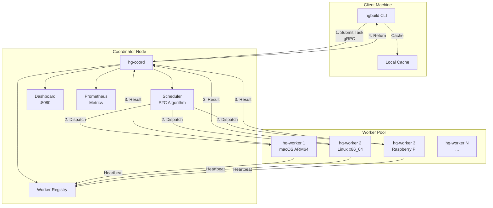

## Compilation Flow

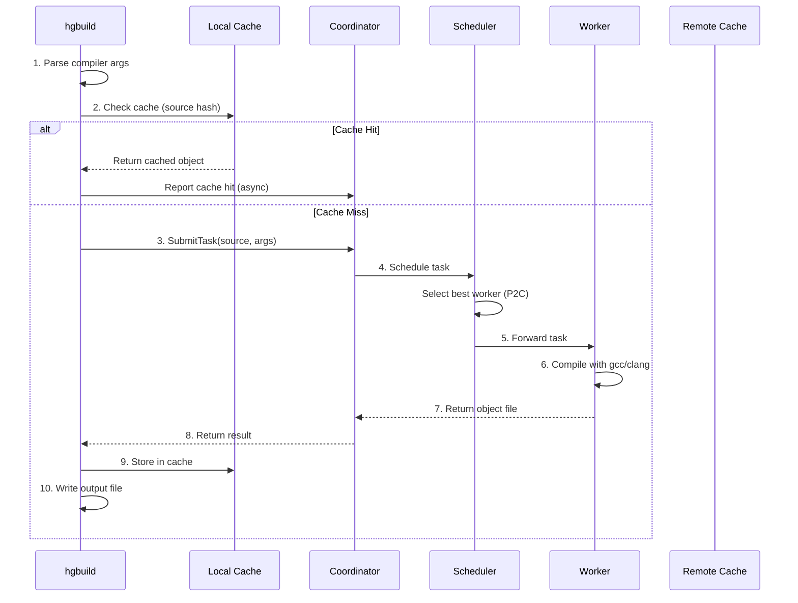

## Worker Selection (P2C Algorithm)

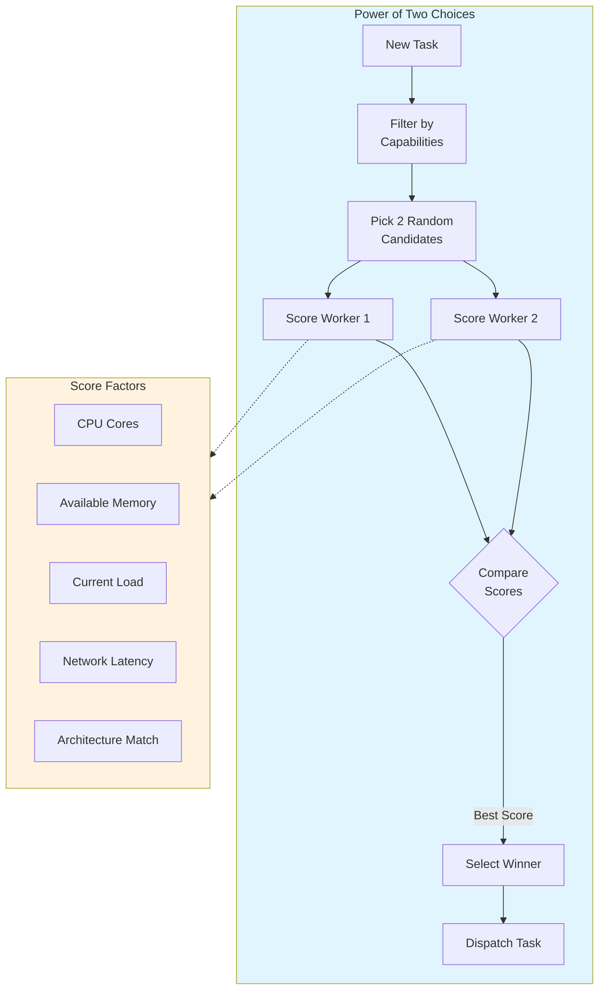

## Fault Tolerance

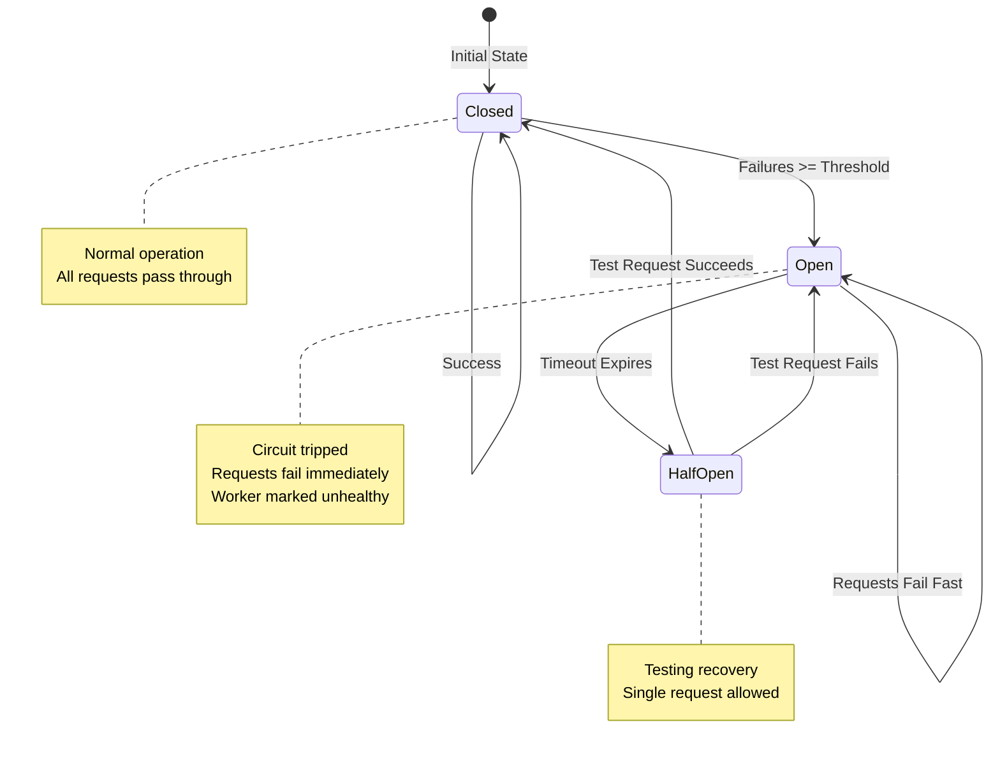

## Cache Architecture

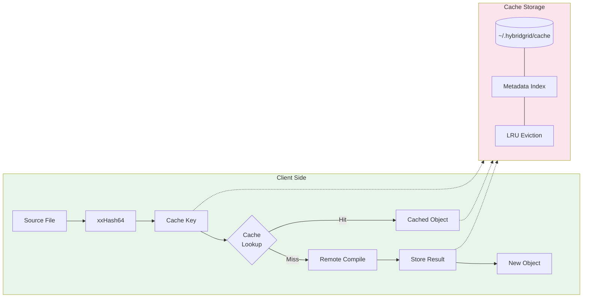

## mDNS Auto-Discovery

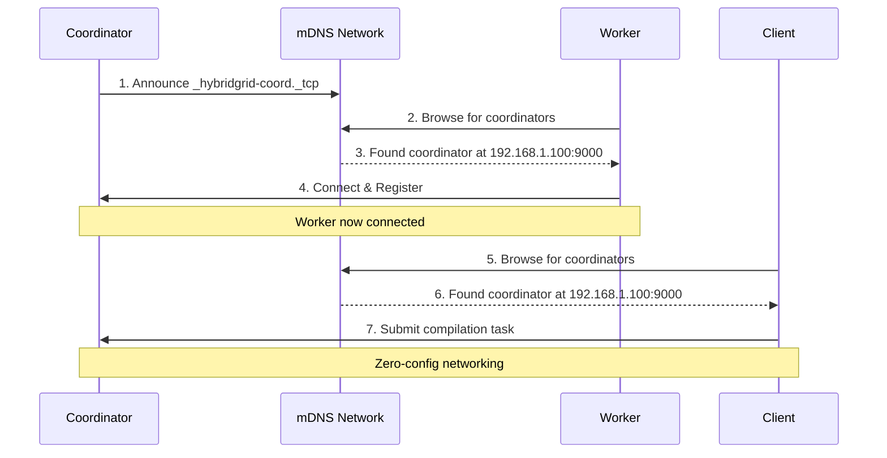

## Cross-Compilation Flow

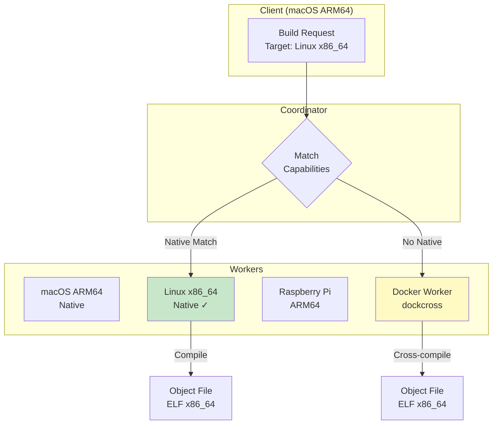

## Request Processing Pipeline

```mermaid
flowchart LR
    subgraph Ingress
        GRPC[gRPC Server]
        AUTH[Auth Check]
        VALID[Validation]
    end

    subgraph Processing
        QUEUE[Task Queue]
        SCHED[Scheduler]
        DISPATCH[Dispatcher]
    end

    subgraph Execution
        WORKER[Worker Pool]
        COMPILE[Compilation]
        RESULT[Result Handler]
    end

    subgraph Egress
        CACHE[Cache Store]
        METRICS[Metrics Update]
        RESPONSE[Response]
    end

    GRPC --> AUTH --> VALID --> QUEUE
    QUEUE --> SCHED --> DISPATCH
    DISPATCH --> WORKER --> COMPILE --> RESULT
    RESULT --> CACHE --> METRICS --> RESPONSE

    style Ingress fill:#e3f2fd
    style Processing fill:#f3e5f5
    style Execution fill:#e8f5e9
    style Egress fill:#fff3e0
```

## Dashboard Architecture

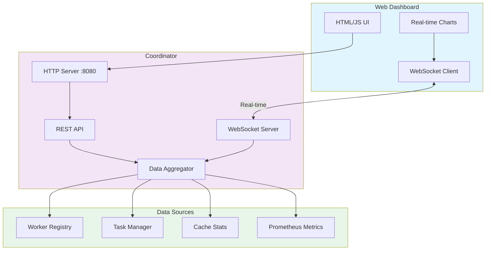

## Component Interactions

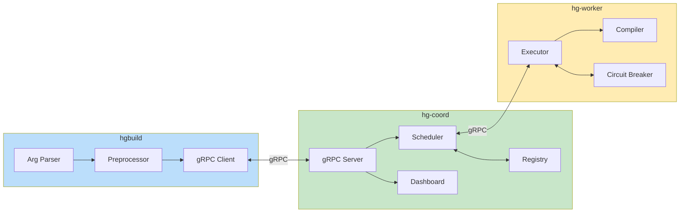

## Metrics Collection

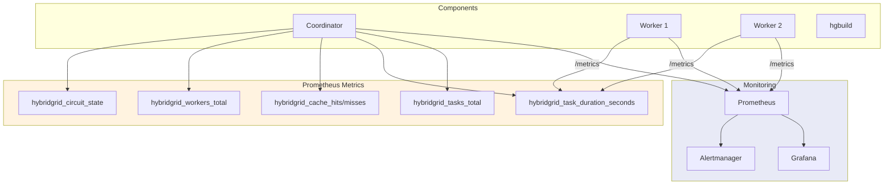

## Network Topology Options

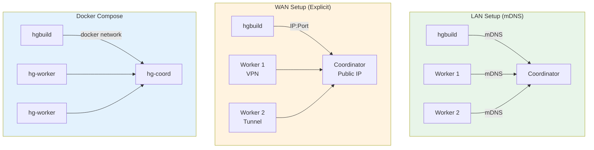

## Rendering Diagrams

To render these Mermaid diagrams:

1. **GitHub**: Diagrams render automatically in markdown files
2. **VS Code**: Install "Mermaid Preview" extension
3. **CLI**: Use mermaid-cli
   ```bash
   npx @mermaid-js/mermaid-cli -i architecture-diagrams.md -o docs/images/
   ```
4. **Web**: Paste into [Mermaid Live Editor](https://mermaid.live)
