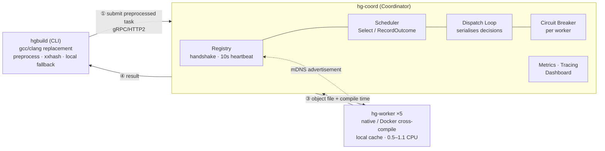
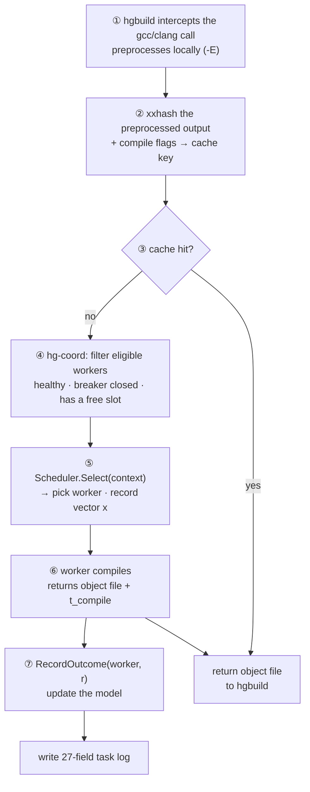
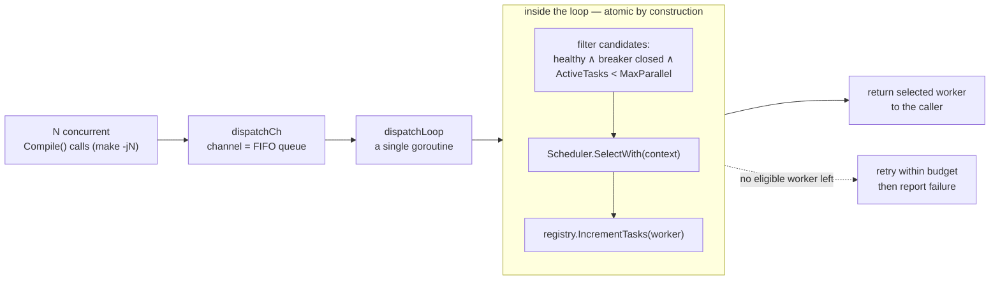

# Hybrid-Grid: A Distributed Compilation System with Contextual-Bandit Task Scheduling on Heterogeneous Clusters

**Le Duc Hieuᵃ˒\*, Nguyen Trung Kienᵃ, Nguyen Trong Khanhᵃ**

ᵃ *Posts and Telecommunications Institute of Technology, Hanoi, Vietnam*

\* *Corresponding author:* leduchieu101@gmail.com

---

## Abstract

This paper presents Hybrid-Grid, an open-source distributed compilation system for C/C++ on heterogeneous worker clusters, and **HG-LinUCB**, the online reinforcement-learning scheduler we propose and adopt as the system's primary scheduling policy. In a distributed compilation system the hardest component is not file transfer or cache management but *deciding which worker each translation unit should go to*: an NP-hard $R||C_{\max}$ problem that must be solved online, over machines differing by up to 2.2× in capacity, under a compile-time distribution whose P99/P50 ratio reaches 26×. We formulate each dispatch decision as a contextual bandit problem with a 12-dimensional context vector describing the task and the worker jointly, a log-latency reward, and an $O(d^2)$ online Sherman–Morrison update. On top of LinUCB, HG-LinUCB adds two orthogonal mechanisms that target the two failure modes a plain bandit exhibits on a real system: a **passive-learning warm-start window** (the learner observes and updates its model while deferring the decision to a heuristic) and a **real-time load-penalty term** $\lambda\cdot\text{LoadRatio}$ subtracted from the UCB score. We also identify four implementation requirements whose violation turns a textbook-correct LinUCB into the worst scheduler in the system (158 s versus 94 s) — most notably a cgroup-blind capability detector that silently holds two of twelve context dimensions constant across every containerised worker, a failure mode we have not seen described elsewhere. Evaluation under a full randomised block design (10 blocks, paired tests, Holm correction) on clean CPython builds shows HG-LinUCB beating plain LinUCB by 8.95 s and Power-of-Two-Choices by 4.66 s with large effect sizes ($p = 0.003$), but not separating from the LeastLoaded heuristic (1.12 s, $p = 0.053$). Reconstructing cluster state at every dispatch instant explains both outcomes through a single mechanism: at typical load, 100% of decisions are taken with an idle worker available, so the only behaviour that can distinguish policies is whether they skip one — HG-LinUCB 0.1% and LeastLoaded 0.0%, versus P2C 22.5% and plain LinUCB 35.0%; when the cluster is driven to saturation, the fraction of dispatches with an idle worker falls to 33%, the two skipping policies' absolute skip rates fall to 5.4% and 7.1%, and all four schedulers become statistically indistinguishable (Friedman $p = 0.375$). The result precisely delimits the conditions under which context-aware scheduling can pay off, and supplies a cheap diagnostic with which any scheduling study can check whether it is really measuring scheduling at all.

**Keywords:** distributed compilation; task scheduling; contextual bandit; LinUCB; online learning; heterogeneous cluster

---

## 1. Introduction

Distributed compilation is an everyday reality of modern software engineering. Large C/C++ projects such as LLVM, Chromium and the Linux kernel contain tens of thousands of translation units; a clean single-machine build can take hours. Systems such as distcc [15], Bazel Remote Build Execution and Incredibuild address this by offloading compilation tasks to a pool of remote workers. That pool is inherently *heterogeneous*: developer laptops, Linux CI servers, cloud ARM nodes, dedicated build machines — differing in CPU cores, memory, instruction-set architecture and instantaneous load.

While building Hybrid-Grid, the distributed compilation system presented in this paper, we found that the components usually considered hard — shipping preprocessed source, content-addressed caching, worker discovery, fault isolation — all have well-understood engineering solutions and, once implemented, work reliably. The component that is genuinely hard is the **scheduler**: the function that decides which worker each translation unit goes to. It is hard for three simultaneous reasons.

First, the underlying problem is theoretically hard. Assigning tasks to heterogeneous machines to minimise makespan is the $R||C_{\max}$ (unrelated parallel machines) problem: NP-hard, inapproximable below ratio $3/2$ unless P = NP, with the best known upper bound at ratio $2$ [1]. Second, it must be solved *online*: tasks arrive sequentially and must be assigned immediately, with no knowledge of the remainder of the stream. Graham's list scheduling [2] achieves a $2 - 1/m$ competitive ratio on identical machines, but no tight universal competitive bound exists for unrelated machines. Third, measurements on our own system show an environment of very high variance: over a CPython build (~295 compilation tasks per build) across a 5-worker heterogeneous cluster, the ratio between the P99 and P50 compile-time percentiles reaches **26×** (pooled over 11,800 tasks), and the busiest worker in a round absorbs **25–31% of all dispatches** under the static heuristics, against the 20% an even split would give.

That third property motivates our approach. The heuristics production systems rely on — round-robin, least-loaded, or Power-of-Two-Choices (P2C) [3] — share one property: each decision is a function only of queue length or a static capability score, and *the outcome of one dispatch never feeds back into the next*. In an environment with high variance and stable heterogeneous structure, a scheduler that observes compilation outcomes and adjusts future decisions — an online learner — could in principle do better.

Published deep reinforcement-learning approaches to scheduling (Decima [12], DeepRM [11]) all require pre-training in a simulator, which does not exist for a build system with real compilers and noisy hardware. We therefore chose the *contextual multi-armed bandit* family [7, 8]: each scheduling decision is a one-step problem, learned online on the running system from observed rewards, with no offline training phase, and with theoretical $O(\sqrt{T})$ regret bounds under a linearity assumption [10]. The representative algorithm of this family is LinUCB [9].

The central contribution of this paper is **HG-LinUCB**, the LinUCB variant we designed specifically for the worker-selection problem and adopted as Hybrid-Grid's primary scheduler. Putting a textbook bandit into a real system exposed two structural failure modes that the theory does not address: *cold start* — immediately after initialisation the model carries no information, so decisions are essentially random, and a single build lasts only a few hundred decisions; and *delayed feedback* — the reward only returns once compilation finishes, and during that multi-second window the bandit does not know it has just piled work onto a worker and keeps piling more. HG-LinUCB addresses both with two orthogonal mechanisms: a warm-start window in which the learner *observes and updates its model while deferring the decision* to a heuristic, and a real-time load-penalty term added to the UCB score that acts as a hand-specified prior blocking pile-up behaviour before the model has accumulated enough data to discover it. The name follows the system: HG-LinUCB is the LinUCB that Hybrid-Grid runs. What the two mechanisms jointly produce is a score assembled from three ingredients of different provenance — value *learned* from context, plus an *exploration* bonus, minus an *instantaneous* signal only a heuristic can supply.

The specific contributions are:

- **C1.** **HG-LinUCB** (Section 5): a formulation of the dispatch decision as a contextual bandit with a 12-dimensional context vector describing the task and the worker jointly, plus two mechanisms — passive-learning warm start and real-time load penalty. The design beats plain LinUCB by 8.95 s and P2C by 4.66 s with large effect sizes under a rigorous evaluation protocol.
- **C2.** **Four implementation requirements** for making a contextual bandit work on a containerised cluster (Section 5.7), with the measured cost of violating each — including a cgroup-blind capability detector that silently degenerates two context dimensions on any Docker or Kubernetes cluster with differing quotas, a failure mode that raises no error, fails no test, and which we have not seen described elsewhere.
- **C3.** **Hybrid-Grid** (Section 3): a complete open-source distributed compilation system in Go — the `hgbuild` CLI as a drop-in gcc/clang replacement, the `hg-coord` coordinator with a registry, a serialised dispatch path, per-worker circuit breakers and a real-time dashboard, and the `hg-worker` worker supporting native and Docker cross-compilation execution; gRPC/HTTP2 with optional TLS/mTLS, mDNS self-discovery, xxhash content-addressed caching, and full observability (Prometheus, OpenTelemetry).
- **C4.** **A noise-controlled evaluation** (Section 7): a full randomised block design with 10 blocks, paired tests and Holm correction, at two dispatch-concurrency levels, analysing the four schedulers that bear on the research question out of six implemented behind one unified interface.
- **C5.** **A dispatch-level mechanism analysis** (Section 7.4): a reconstruction of worker availability at every decision instant, showing that the entire measurable spread between schedulers reduces to exactly one behaviour. This doubles as a cheap diagnostic with which any scheduling study can check whether its operating point actually permits policies to be distinguished.

The remainder of the paper is organised as follows. Section 2 reviews related work. Section 3 describes the architecture and operation of Hybrid-Grid. Section 4 states the scheduling problem and casts it as a contextual bandit. Section 5 — the core of the paper — presents the design of HG-LinUCB. Section 6 describes the five baseline schedulers. Section 7 presents the experimental evaluation. Section 8 discusses, and Section 9 concludes.

## 2. Related Work

### 2.1. Heuristic scheduling on heterogeneous machines

Lenstra, Shmoys and Tardos [1] proved $R||C_{\max}$ NP-hard with a $3/2$ approximation lower bound and gave a ratio-$2$ algorithm; the gap remains open after more than 35 years. In practice Power-of-Two-Choices [3] is the prominent heuristic: sampling two servers at random and choosing the less loaded one reduces maximum load from $\Theta(\log n / \log\log n)$ to $\Theta(\log\log n)$ on homogeneous clusters. Sparrow [4] extends P2C with late binding for low-latency decentralised scheduling. HEFT [5] is the classical algorithm for task DAGs on heterogeneous machines, ranking tasks by upward rank and assigning by earliest finish time; we adapt HEFT to an online task stream using EWMA compile-time estimates. What the whole family shares: decisions based on queue state or static capability, never on per-task outcomes.

### 2.2. Multi-armed and contextual bandits

The classical bandit framework with ε-greedy and sample-average updates is presented systematically in Sutton and Barto [6]; UCB1 by Auer et al. [16] introduced optimism-under-uncertainty into arm selection. Slivkins [7] and Lattimore–Szepesvári [8] systematise the regret theory. LinUCB [9] extends to the contextual setting: each arm maintains a linear model $(A_a, b_a)$ and is scored by $\hat{\theta}_a^\top x + \alpha\sqrt{x^\top A_a^{-1} x}$. A $\tilde{O}(\sqrt{Td})$ regret bound is proven for the SupLinUCB variant [10]; notably that bound does *not* apply directly to the LinUCB Algorithm 1 that real systems (including ours) implement — a point we state honestly in Section 8.3.

### 2.3. Machine learning for systems scheduling

Decima [12] uses a graph neural network with REINFORCE to schedule Spark jobs, achieving up to 1.5× improvement in job completion time, but requires thousands of training episodes in a simulator before deployment. DeepRM [11] is the earliest work applying policy gradients to resource management, also simulator-dependent. Quasar [13] uses collaborative filtering (supervised learning, no exploration) to predict job performance on each machine type. Resource Central [14] uses random forests to predict VM lifetimes in Azure — offline supervised learning at production scale. The gap this work targets: *online, simulator-free learning applied specifically to distributed compilation* — to our knowledge no published work applies contextual bandits to this problem and describes the implementation pitfalls that arise when interacting with real compile-latency distributions.

### 2.4. Distributed build systems

Production build systems fall into three classes: *cache-first* systems (ccache, sccache, Bazel RBE) prioritise hash-based cache lookup and select workers round-robin or least-loaded; *capability-scoring* systems (distcc [15]) rank workers by static capability; *DAG-aware* systems (Bazel, Buck2) use the build graph to defer decisions but still schedule by capability within each DAG layer. Most do not adapt to observed execution outcomes, though this is not absolute: Buildbarn [22], for instance, learns per-action-digest size-class outcomes across builds using a persisted PageRank-style analyser (`InitialSizeClassCache`), serving resource-class prediction rather than worker selection. What we have not found in any production build system is worker selection posed as a per-decision contextual bandit with an explicit reward signal and regret reasoning — precisely the gap this paper targets. The nearest works use offline ML to predict task duration and then dispatch heuristically on those predictions: supervised-learning scheduling, not bandit scheduling.

## 3. The Hybrid-Grid System

### 3.1. Architecture

The system comprises three components communicating over gRPC on HTTP/2 (optional TLS/mTLS), laid out as in Figure 1:

- **`hgbuild` (CLI):** a drop-in gcc/clang replacement that also wraps `make`/`ninja`. It preprocesses source locally, hashes the preprocessed output with xxhash for cache lookup, submits the task to the coordinator, and automatically *falls back* to local compilation when the coordinator is unavailable — so an infrastructure failure slows a build down rather than breaking it.
- **`hg-coord` (Coordinator):** the central orchestrator, comprising the worker registry (gRPC handshake registration, 10-second heartbeats), the **scheduler** (the primary object of study, Sections 4–6), the serialised dispatch path (Section 3.3), per-worker circuit breakers for fault isolation, Prometheus metrics, OpenTelemetry tracing, and a real-time WebSocket dashboard.
- **`hg-worker` (Worker):** executes compilation in two modes — native (invoking gcc/clang directly) or Docker (cross-compilation via dockcross images); maintains a local content-addressed cache (~10× speedup on cache hits); self-advertises via mDNS for zero-configuration discovery.



**Figure 1.** Hybrid-Grid architecture. `hgbuild` submits preprocessed tasks to `hg-coord`; the scheduler selects one of five heterogeneous workers; the result with its compile time flows back, serving both as the client's answer and as the reward signal for the learning scheduler.

Beyond the C/C++ path that is our focus, the system also supports distributed Flutter Android builds and GCC/Clang-to-MSVC flag translation; these paths do not go through the learning scheduler and are out of the evaluation's scope.

### 3.2. Lifecycle of a compilation task

The seven steps below are the full path of one translation unit, and are the context needed to understand what the scheduler sees, and when.



**Figure 2.** Lifecycle of one translation unit. The scheduler participates only at step ⑤, and sees cluster state only *as of that instant*; the reward for that decision returns only at step ⑦, after compilation completes — that delay is precisely the "delayed feedback" failure mode addressed in Section 5.5.

Two properties of this lifecycle shape the entire algorithm design in Section 5. First, between steps ⑤ and ⑦ there is a gap equal to the compile time (P50 a few hundred milliseconds, P99 up to 5–8 seconds), and within that gap dozens of other decisions may be taken before any of them receives its reward. Second, a clean build produces only 295 decisions — a very short horizon for an online learner, which makes early-stage sample efficiency more important than asymptotic behaviour.

### 3.3. The coordinator's dispatch path

Steps ④–⑤ of Figure 2 must withstand many concurrent `Compile()` calls: with a `make -jN` flag, up to $N$ tasks request a decision simultaneously. The scheduling decision reads worker state (`ActiveTasks`) and the dispatch writes it back; if these are two separate operations across concurrent goroutines, two dispatches can read the same stale `ActiveTasks`, pick the same low-capacity worker, and overbook it. We rule that out by confining all three operations — reading worker state, selecting a worker, and recording the dispatch — to a single goroutine (Figure 3), so they are atomic with respect to one another by construction, with no explicit locking.

Hybrid-Grid therefore serialises the entire decision path through **a single `dispatchLoop` goroutine** that owns every `SelectWith`+`IncrementTasks` pair for the coordinator's lifetime. Each `Compile()` call submits a request into a `dispatchCh` channel and waits for the result. We use a Go channel rather than a hand-rolled queue because a channel already *is* a synchronised FIFO queue, whereas a manual linked list touched by many goroutines would merely relocate rather than eliminate the same locking requirement.



**Figure 3.** The serialised dispatch path. Reading worker state, selecting a worker and recording the dispatch all sit inside a single goroutine, so they are atomic with respect to one another by construction, without explicit locking.

The candidate filter runs *before* the scheduler and is a shared invariant across all six schedulers: a worker must be healthy, its circuit breaker must be closed, and it must have a free slot (`ActiveTasks < MaxParallel`). As a result no scheduler, not even the simplest heuristic, can ever select a fully loaded worker. We verify the dispatch path's correctness with a dedicated concurrency regression test: 5 workers with `MaxParallel = 1` each, 40 batches of 5 concurrent dispatch-and-release cycles, and an independent atomic counter asserting that no worker is ever held above capacity; the test passes cleanly over 20 repeated runs.

When every worker is full, `SelectWith` returns `ErrNoMatchingWorkers` and the coordinator retries within a bounded budget (`maxDispatchAttempts = 8`, `attempt × 25 ms` backoff, roughly 700 ms total) before reporting failure. This is a known design limitation we state plainly: that budget was set assuming compile times in the ~10–500 ms range, whereas the measured P99 on our workload is 5–8 seconds — off by one to two orders of magnitude. The consequence is that the coordinator tolerates load up to exactly the cluster's total capacity but has no true backpressure for sustained overload; we return to this in Sections 7.1 and 8.3.

### 3.4. Observability and the task log

Every completed `Compile()` call emits a 27-field JSON Lines record via `TaskLogger`: identifiers (task, build type, scheduler), **worker context as of the dispatch instant** (cores, RAM, architecture, active task count, discovery source), task specification (raw and preprocessed source size, target architecture), latency decomposition (queue / compile / RPC / total), outcome (success, exit code, cache hit), and learner introspection (Q-value at dispatch, exploration flag). Files load directly into pandas via `read_json(lines=True)`.

Recording context *as of dispatch* rather than as of completion is a deliberate design decision, and it is precisely what makes the mechanism analysis in Section 7.4 possible: from each task's (dispatch timestamp, total duration) pair we can reconstruct exactly what state the cluster was in when each individual decision was taken.

## 4. The Scheduling Problem

### 4.1. Statement

Given a set of heterogeneous workers $\mathcal{W} = \{1,\dots,m\}$ and a stream of compilation tasks $1,2,\dots,T$ arriving sequentially, task $t$ has an execution time $p_{t,a}$ that depends on the assigned worker $a$, is unknown in advance, and is observable only after completion. The scheduler must choose $a_t \in \mathcal{W}_t$ the moment task $t$ arrives, where $\mathcal{W}_t$ is the filtered candidate set of Section 3.3. The objective is to minimise the makespan $C_{\max} = \max_a \sum_{t: a_t = a} p_{t,a}$ — subject to each worker $a$ running at most `MaxParallel`$_a$ tasks concurrently.

Our evaluation cluster has $m = 5$ and $\sum_a$ `MaxParallel`$_a = 10$ slots; CPU capacity is divided unevenly as 0.5 / 0.6 / 0.8 / 1.0 / 1.1 cores, i.e. a **2.2× spread** between the strongest and weakest worker.

### 4.2. Why a contextual bandit

Three properties of the problem determine the modelling choice.

*Rich context is available at decision time.* The coordinator knows the preprocessed source size, the language, the target architecture, and for each worker: CPU/RAM capacity, current queue depth, recent RPC latency, success history. This is exactly the setting contextual bandits were designed for, and exactly what both context-blind ε-greedy and static heuristics discard.

*The reward is directly observable.* The compile time reported back by the worker is a clean scalar signal requiring no credit assignment across multiple steps.

*Coupling between decisions is weak.* Compilation tasks are nearly independent; once a queue-depth feature is in the context vector, the residual state coupling between consecutive decisions is small [7]. A full MDP would require attributing makespan back to individual dispatch decisions — a sparse-reward credit-assignment problem over hundreds of steps, precisely the regime in which policy-gradient methods need the simulator [11, 12] that we deliberately do without.

### 4.3. Formulation

At decision time $t$, the coordinator observes a context vector $x_{t,a} \in \mathbb{R}^d$ for each eligible worker $a \in \mathcal{W}_t$, selects an action $a_t$, dispatches the task, and upon completion receives a scalar reward

$$r_t = -\log\bigl(1 + t_{\text{compile}}^{(t)}\bigr),$$

where $t_{\text{compile}}^{(t)}$ is the worker-reported compile time in milliseconds. The log transform is an engineering choice to compress the distribution's heavy tail (P99/P50 ≈ 26×): uncompressed, a single 24-second outlier would dominate the model's updates. Failed tasks (timeout, worker error) receive $r = -\log(1 + T_{\text{timeout}})$, with $T_{\text{timeout}} = 5$ minutes, the client-side task deadline — the worst case the system can observe — so the learner automatically devalues persistently broken workers with no separate error-handling rule. We note honestly that this reward shape has no direct peer-reviewed source; the closest theoretically motivated form is Decima's time-integrated reward [12].

The system's `Scheduler` interface provides `Select(buildType, arch, clientOS) → (Worker, error)`. The extended `LearningScheduler` interface adds `SelectWithDispatchInfo` (returning the Q-value and exploration flag for logging) and `RecordOutcome(workerID, reward, success)`. The `Compile()` handler uses a type assertion to feed rewards back only when a learner is configured, so the heuristics require no modification. This framework is the common substrate for all six schedulers.

## 5. HG-LinUCB: The Proposed Learning Scheduler

This is the paper's central algorithmic contribution. Sections 5.1–5.2 build the LinUCB foundation and the context design; Section 5.3 identifies two failure modes of the plain bandit on a real system; Sections 5.4–5.6 present the two remedial mechanisms and the complete algorithm; Section 5.7 states four mandatory implementation requirements.

### 5.1. Foundation: disjoint LinUCB for worker selection

We map each worker to an *arm* and use the disjoint model of Li et al. [9]: each worker $a$ has its own parameters, shared with no other. For each $a$ we maintain $A_a \in \mathbb{R}^{d\times d}$ initialised to $I_d$ and $b_a \in \mathbb{R}^d$ initialised to $\mathbf{0}$; the current ridge-regression estimate is $\hat{\theta}_a = A_a^{-1} b_a$. At round $t$ the UCB score of each eligible worker is

$$p_{t,a} = \underbrace{\hat{\theta}_a^\top x_{t,a}}_{\text{learned expected value}} + \underbrace{\alpha\sqrt{x_{t,a}^\top A_a^{-1}\, x_{t,a}}}_{\text{exploration bonus}},$$

we select $a_t = \arg\max_a p_{t,a}$, and when the reward arrives we update $A_{a_t} \leftarrow A_{a_t} + xx^\top$, $b_{a_t} \leftarrow b_{a_t} + rx$.

The disjoint model suits this problem: workers are physically distinct machines, and we *want* the model to learn that a large C++ task behaves differently on a 0.5-CPU worker than on a 1.1-CPU worker — sharing parameters would blur exactly the distinction we need to exploit. The price is that each worker needs its own data to warm up, and that is one of the two problems Section 5.3 raises.

One point of terminology, since it is a live source of confusion. We use Algorithm 1 of Li et al. — the *disjoint* model — throughout. Their Algorithm 2 is called the *hybrid linear model* and is a different construction: it adds a coefficient vector $\beta^*$ **shared across all arms** alongside the per-arm $\theta_a$. We do not use it. The "HG" in HG-LinUCB stands for Hybrid-Grid, the system, and carries no claim about the model class.

### 5.2. Context vector design ($d = 12$)

The context vector $x_{t,a}$ describes the *pair* (task, worker) — this is the core distinction from ε-greedy, which holds only a single value $Q(a)$ per worker regardless of the task. Table 1 lists the layout and normalisation; all features are mapped approximately into $[0,1]$ to keep $\|x\|$ bounded, following the linear convention of [10].

**Table 1.** The 12-dimensional context vector of HG-LinUCB. Dimensions 1–3 and 9–10 describe the task; 4–8 and 11 describe the worker and its instantaneous state.

| # | Feature | Source | Normalisation |
|---|---|---|---|
| 0 | bias | — | constant 1.0 |
| 1 | log preprocessed source size | task | $\log(1+s)/\log(1+4\,\text{MiB})$, clipped at 1 |
| 2 | target arch = x86_64 | task | one-hot 0/1 |
| 3 | target arch = arm64 | task | one-hot 0/1 |
| 4 | worker CPU capacity (log scale) | worker | $\log(1+m)/\log(1+16000)$, $m$ = cgroup milli-cores if detected, else cores×1000 |
| 5 | worker memory (log scale) | worker | $\log(1+b)/\log(1+64\,\text{GiB})$, $b$ in bytes |
| 6 | native arch matches target | pair | 0/1 |
| 7 | queue pressure (LoadRatio) | worker, instantaneous | active_tasks/max_parallel, clipped at 1 |
| 8 | recent RPC latency | worker, instantaneous | ms/100, clipped at 1 |
| 9 | task is C++ | task | 0/1 |
| 10 | log raw source size | task | $\log(1+s_{\text{raw}})/\log(1+1\,\text{MiB})$, clipped at 1 |
| 11 | success rate (Laplace) | worker, history | $(s+1)/(s+f+2)$ |

Two principles govern this design, both learned from versions that did not work.

**No dimension may be collinear with another.** The initial design included a three-dimensional one-hot for build type (CPP / Flutter / Unity); since the `Compile()` path currently produces only CPP, the CPP column coincided exactly with the bias and the other two were permanently zero. These three dead dimensions made $A_a$ singular in the corresponding directions and contributed no information; we removed them. Likewise, the success-rate feature in raw form with an optimistic prior would equal exactly 1.0 for every worker on a fully successful workload — collinear with the bias again — so we apply Laplace smoothing to keep the column dependent on actual experience.

**Every worker-describing dimension must actually vary across workers.** Dimensions 4 and 5 exist so the bandit can distinguish hardware capacity, and they can only do so if their data source reflects the capacity *of the container*, not of the host. This is the strictest implementation requirement in the whole system and we present it separately in Section 5.7.

One caveat about our own cluster follows from the first principle. Docker Compose provisions each worker's memory in proportion to its CPU quota, so on this particular cluster dimensions 4 and 5 are almost perfectly correlated after normalisation ($r = 0.99999$ across the five workers). The design admits independent variation on the two axes and a cluster with, say, a memory-rich low-core node would exercise it, but our evaluation does not: in effect the bandit sees one capacity axis, not two. Ridge regularisation keeps $A_a$ invertible regardless, and nothing in the results depends on the two being distinct, but we note it rather than let Table 1 imply twelve independently informative dimensions.

### 5.3. Two failure modes of the plain bandit on a real system

With the context designed correctly, standard LinUCB still exhibits two structural problems inside Hybrid-Grid. Both are direct consequences of the task lifecycle in Figure 2 rather than defects of the algorithm.

**(F1) Cold start over too short a horizon.** Immediately after initialisation, $A_a = I_d$ and $b_a = \mathbf{0}$, so $\hat\theta_a = \mathbf{0}$ and the UCB score reduces to the exploration bonus alone — decisions are essentially random. For a bandit in online advertising this phase is negligible over millions of impressions. For us, a clean build has only 295 decisions, and the coordinator typically restarts between builds; a random phase lasting a few dozen decisions is already several percent of the whole makespan wasted.

**(F2) Delayed feedback causes pile-up.** The reward returns only at step ⑦, after compilation finishes. Throughout that window — as long as the compile time, up to 5–8 seconds at P99 — a worker's model remains exactly as it was before it received the task. If $\hat\theta_a$ currently rates worker $a$ best, the bandit will select it repeatedly for every decision in that window, piling dozens of tasks onto one machine before any negative signal returns. The LoadRatio feature ($x[7]$) *in principle* encodes this state, but the model can only use it after learning a negative weight for it — that is, after paying for the pile-up behaviour many times over.

The two modes are different in kind — one is a lack of data, the other a lack of data freshness — so we address them with two orthogonal mechanisms, each with its own configuration parameter and each independently disableable.

### 5.4. Mechanism 1 — A passive-learning warm-start window

For the first $N$ dispatches (default $N = 100$, configured via `--warm-start`), the decision is delegated to the least-loaded heuristic: pick the worker with the smallest `ActiveTasks` among the filtered candidates. But the learner does **not** sit idle. It still computes the context vector $x$ of the selected worker, still stores $x$ keyed by TaskID, and when the reward arrives still performs the normal Sherman–Morrison update.

The key point is that *the learner learns from data generated by a different policy*. This is off-policy learning in its simplest form: the least-loaded heuristic acts as a safe behaviour policy, generating (context, reward) pairs spread across all workers — and spread fairly evenly, since distributing tasks is exactly what least-loaded does. After $N$ dispatches the bandit takes over with $A_a$ and $b_a$ warmed by real observations rather than an empty prior.

Choosing $N = 100$ for a 295-task build is a deliberate trade-off: roughly a third of the decisions go to safe data collection, the remaining two thirds to the learned policy. Because $N < 295$, the bandit converges *within* a single build, independent of state from prior builds — a property we verify empirically in Section 7.5.

### 5.5. Mechanism 2 — A combined score with a real-time load penalty

After warm start, the worker score is no longer the plain UCB score but

$$Q_{\text{HG}}(a) = \underbrace{\hat{\theta}_a^\top x}_{\text{learned value}} \;+\; \underbrace{\alpha\sqrt{x^\top A_a^{-1} x}}_{\text{exploration bonus}} \;-\; \underbrace{\lambda \cdot \text{LoadRatio}_a}_{\text{instantaneous overload penalty}},$$

with $\lambda$ defaulting to 0.5, configured via `--load-penalty`.

The third term is what separates HG-LinUCB from the plain bandit. LoadRatio is already feature $x[7]$, so in theory LinUCB can learn a negative weight for it on its own — and eventually it will. The penalty term acts as a **hand-specified prior** that imposes knowledge we already know to be correct, using *real-time* information (the running task count, updated to the millisecond at dispatch, exactly as LeastLoaded uses it) instead of information learned *slowly* through delayed rewards. Put differently: the bandit supplies what the heuristic lacks (an understanding of the task–worker pair), and the load penalty supplies what the bandit lacks (queue state as of right now). This is the direct countermeasure to (F2).

We constrain $\lambda \in [0, 5]$: too large a $\lambda$ makes the penalty term dominate every learned estimate and the algorithm degenerates into plain LeastLoaded. At the other end, when $\lambda = 0$ *and* $N = 0$, behaviour is bit-for-bit identical to plain LinUCB — both schedulers share one code path and differ only in configuration, so the comparison between them in Section 7 isolates exactly the two mechanisms' contribution and no implementation difference.

### 5.6. The complete algorithm and its complexity

```
Algorithm 1: HG-LinUCB (one dispatch decision)
─────────────────────────────────────────────────────────────
Parameters: α (exploration bonus), N (warm-start window), λ (load-penalty weight)
Per-worker state a: A_a ∈ R^{d×d} (init I_d), b_a ∈ R^d (init 0),
                     A_a^{-1} cached; n = number of dispatches so far

SELECT(task τ, candidate set W_t):
  1  if |W_t| = 1:  return the single worker              ▷ fast path, skip matrix algebra
  2  for each a ∈ W_t:  x_a ← BuildContext(τ, a)          ▷ Table 1; read state HERE
  3  if n < N:                                            ▷ Mechanism 1: passive warm start
  4      a* ← argmin_{a ∈ W_t} ActiveTasks(a)
  5  else:                                                ▷ Mechanism 2: combined score
  6      for each a ∈ W_t:
  7          θ̂_a ← A_a^{-1} b_a
  8          Q_a ← θ̂_aᵀ x_a + α·sqrt(x_aᵀ A_a^{-1} x_a) − λ·LoadRatio(a)
  9      a* ← argmax_{a ∈ W_t} Q_a
 10  pendingContext[τ.ID] ← x_{a*}                        ▷ freeze the decision's context
 11  n ← n + 1;  return a*

RECORDOUTCOME(τ, worker a, compile time t_c, success):
 12  x ← pendingContext[τ.ID];  delete the entry
 13  r ← −log(1 + t_c)   if success,  else  −log(1 + T_timeout)
 14  b_a ← b_a + r·x
 15  A_a^{-1} ← A_a^{-1} − (A_a^{-1} x xᵀ A_a^{-1}) / (1 + xᵀ A_a^{-1} x)   ▷ Sherman–Morrison
─────────────────────────────────────────────────────────────
```

**Sherman–Morrison inverse update.** Each update is rank-1: $A_{\text{new}} = A_{\text{old}} + xx^\top$. Recomputing the inverse from scratch costs $O(d^3)$; the Sherman–Morrison formula [17] at line 15 of Algorithm 1 reduces this to $O(d^2)$:

$$A_{\text{new}}^{-1} = A_{\text{old}}^{-1} - \frac{A_{\text{old}}^{-1} x x^\top A_{\text{old}}^{-1}}{1 + x^\top A_{\text{old}}^{-1} x}.$$

A unit test compares the cached inverse against a fresh inversion via `gonum/mat` after 50 random updates; element-wise deviation stays below $10^{-6}$.

**Complexity.** With $d = 12$ and $|\mathcal{W}_t| \le m$: each `Select` costs $O(m d^2)$, each `RecordOutcome` $O(d^2)$, with $O(m d^2)$ memory. Concretely, with $d = 12$ and $m = 5$ a decision costs a few hundred floating-point operations, against the millisecond-scale gRPC round-trip that the dispatch itself incurs. We did not instrument the scoring step separately: the two are three orders of magnitude apart, and no plausible measurement would reverse that ordering.

**The single-candidate fast path** (line 1 of Algorithm 1) exists for a practical reason: when only one eligible worker remains there is no *decision* to make, so all the matrix algebra is pure waste. We added it after measuring a 41% penalty from P2C's filtering pipeline on a one-worker cluster; all three learning schedulers share this fast path.

### 5.7. Four mandatory implementation requirements

While bringing the algorithm into a real running system, we identified four requirements whose violation turns an *algorithmically correct* LinUCB implementation into the worst scheduler in the system — 158 s against 94 s for P2C on the 5-worker cluster, i.e. slower than a policy that ignores every signal the bandit was designed to exploit. The makespans, exploration rates and dispatch ratios quoted in this section and in Section 5.8 are **single-run measurements** taken while the implementation was being brought up; we report them to convey the size of the effect, not as controlled comparisons. Every controlled comparison in this paper is in Section 7. None is a defect of LinUCB; all four are state-management, scale-normalisation and instrumentation issues that surface only when the bandit is wired into a real, concurrent system rather than a simulator. We present them as design requirements because we believe they transfer to any bandit deployment in a distributed system. Table 2 summarises all four together with the measured evidence for each.

**Table 2.** Four implementation requirements, the consequence of violating each, and the measured evidence.

| Requirement | Violation produces | Measured evidence |
|---|---|---|
| **R1.** Freeze the context at *decision* time; do not rebuild it at update time | target leakage | the model is fitted against worker state *after* completion — information the policy could not have had |
| **R2.** Eliminate all collinear dimensions | singular $A_a$, dead dimensions | build-type one-hot ≡ bias column; 3/15 dimensions carry no information |
| **R3.** Balance the reward scale against the exploration bonus | exploration collapse | $\lvert r\rvert \approx 7$ swamps the bonus; effective exploration rate 1.7% |
| **R4.** Read worker capacity from cgroup, not from the host | context degenerate along the axis that matters most | 2/12 dimensions constant across all workers; a real 2.2× capacity spread erased |

R1 is satisfied by caching the vector $x$ at `Select` keyed by TaskID (line 10 of Algorithm 1) and looking it up at update time (line 12) — this is why `pendingContext` exists in the algorithm. R2 is satisfied by the 12-dimensional layout of Table 1. R3 is satisfied by $\alpha = 0.5$ rather than 1.0, which raises the effective exploration rate from 1.7% to 25.1% and reduces load skew from a 97:1 dispatch ratio to 13.9:1.

**R4 deserves separate treatment**, because it is the only one of the four we have not seen described anywhere, and because it is invisible to every conventional form of testing. Dimensions 4 and 5 of the context vector exist to distinguish workers by CPU and memory capacity. The initial implementation of `capability.Detect()` read `runtime.NumCPU()` and `/proc/meminfo` — but inside a container both return the values of the *host*, not the container's cgroup quota. On our 5-worker cluster limited to 0.5 / 0.6 / 0.8 / 1.0 / 1.1 CPU via Docker Compose, all five workers therefore reported identical core counts and identical RAM. Two of twelve context dimensions became constant across every arm, and the real 2.2× capacity spread — the very axis along which this cluster is heterogeneous — was erased from the learner's view entirely. The model was not wrong; it was simply blind.

What makes R4 dangerous is that it produces no symptom whatsoever: no error, no warning, no failing test. The bandit still runs, still converges, still reports plausible Q-values — it just converges to a policy that cannot tell a strong worker from a weak one. Any learning or capability-scoring scheduler deployed on Docker or Kubernetes with differing quotas is exposed to this failure mode.

The fix has three parts: read `/sys/fs/cgroup/cpu.max` (cgroup v2) or `cpu.cfs_quota_us` / `cfs_period_us` (v1) directly; add a **milli-core** resolution field to carry fractional quota values that the old integer-core field could not represent (0.5 CPU rounds to 0 or 1); and change normalisation from linear — which compressed the 0.5–1.1 core range into just 0.03–0.07 of $[0,1]$, too small for ridge regression to separate from noise — to the $\log(1+x)$ scale of Table 1. We verified the fix end to end rather than by unit test alone, cross-checking worker registration records and task logs on the real cluster against the Compose file, confirming exact byte-for-byte and milli-core-for-milli-core agreement with the declared quotas.

With all four requirements satisfied, makespan on the 5-worker cluster recovered from 158 s to 94 s — coincidentally the same figure P2C scores on this configuration, so the repaired bandit went from last place to level with the best heuristic. **All 64 seconds came from implementation discipline; not a single line of the LinUCB algorithm changed.** This is the clearest transferable lesson of this section: for a contextual bandit in a real system, instrumentation quality matters far more than hyperparameter tuning.

### 5.8. Hyperparameter sensitivity

An $\alpha$ sweep on the 5-worker configuration (with all four requirements satisfied) gives makespans of 98 s ($\alpha = 0.1$), 94 s ($\alpha = 0.5$) and 96 s ($\alpha = 2.0$); $\alpha = 0.5$ is our default. Every value in the measured range is competitive with the best heuristic, with differences inside the noise margin of a single-run measurement — reinforcing the observation in Section 5.7 that the algorithm is not sensitive to $\alpha$ at anything like the magnitude of a violated implementation requirement. We hold $N = 100$ and $\lambda = 0.5$ fixed across every experiment reported in this paper.

## 6. Baseline Schedulers

To evaluate HG-LinUCB fairly we implemented five other schedulers behind the *same* `Scheduler` / `LearningScheduler` interface, sharing the candidate filter of Section 3.3 and the single-candidate fast path. The scheduler is selected at startup via the `--scheduler` flag, with per-scheduler options (`--epsilon`, `--alpha`, `--warm-start`, `--load-penalty`). HG-LinUCB itself is selected as `--scheduler hybrid-linucb`, the identifier it carries in the source code and in the released measurement logs.

1. **LeastLoaded** — selects the worker with the smallest `ActiveTasks`. No parameters, no learned state. This is the strongest baseline and the principal opponent in the evaluation.
2. **P2C** — samples two workers at random and selects by static weighted score [3]. Represents the family of randomised heuristics common in production load balancing.
3. **HEFT** — estimates compile time by EWMA ($\alpha = 0.3$) and assigns by earliest finish time [5]. Represents prediction-based scheduling without exploration.
4. **ε-greedy** — maintains a per-worker sample average $Q(a)$ of observed rewards, exploring uniformly at random with probability $\varepsilon = 0.1$ [6]. It learns online from exactly the same reward signal as HG-LinUCB but is **context-blind** — ignoring task size, worker hardware and queue pressure — so a gap between it and HG-LinUCB would isolate the value of context itself.
5. **LinUCB** — the disjoint contextual linear bandit of Section 5.1, i.e. HG-LinUCB with $N = 0$ and $\lambda = 0$. This is the *ablation of the two proposed mechanisms*, running on the same code path.

Of these five, the blocked evaluation of Section 7 carries three: LeastLoaded, P2C and LinUCB. **LinUCB is the ablation our central claim rests on** — it differs from HG-LinUCB only in $N$ and $\lambda$, on one shared code path, so the gap between them isolates the two proposed mechanisms and nothing else. HEFT and ε-greedy were implemented and exercised only in preliminary single-run measurements; we did not carry them into the 10-block protocol, so this paper makes no statistically supported claim about either, and the value of context *as such* remains untested under a controlled protocol. Section 8.3 records this as a limitation.

## 7. Experimental Evaluation

### 7.1. Setup and protocol

**Workload.** A clean CPython build via `make` with `hgbuild` as the compiler driver — 295 translation units per build, with the compilation cache cleared before every run.

**Cluster.** Docker Compose on a single host, a fixed 4.0-core CPU budget divided unevenly across 5 workers (0.5 / 0.6 / 0.8 / 1.0 / 1.1 cpu) via cgroup limits, for 10 concurrent dispatch slots in total.

**Two operating points.** We measure at two dispatch-concurrency levels. `-j5` is the typical-load point: half the cluster's capacity, corresponding to how a developer would ordinarily invoke `make -j`. `-j10` is **saturation**: exactly the cluster's 10-slot total capacity, the highest concurrency the coordinator serves with 100% reliability. We established that threshold by binary search on the real cluster (`-j5`, `-j6` clean; `-j7`–`-j8` beginning to fail; `-j16` failing badly), and the `-j9`/`-j10` mark was reachable only after the dispatch path was serialised as described in Section 3.3. Beyond it, the retry-budget limitation noted in Section 3.3 makes builds fail rather than merely slow down, so we have no data on the sustained-overload regime.

**Metrics.** Makespan (wall-clock) is the primary metric; we also report per-worker dispatch distribution (Section 7.6) and compile-time percentiles pooled over the 11,800 tasks at each operating point — P50 / P95 / P99 of 257 / 2,119 / 6,623 ms at `-j5` and 426 / 3,250 / 10,311 ms at `-j10`.

**Statistical design.** Preliminary measurements showed that Docker on a single host has a substantial run-to-run noise floor, so single-run comparisons cannot support conclusions. More importantly, a "scheduler-major" layout — running all repetitions of one scheduler before moving to the next — *confounds* scheduler identity with slow host drift (thermal, background load). We therefore use a **full randomised block design**: 10 rounds, each running every scheduler configuration under test exactly once in a per-round seeded shuffled order, with a discarded warm-up build, a barrier waiting for all workers to register, a fixed cooldown between builds and sub-second timing. Each round executed five configurations; the four analysed here are the ones that bear on the research question, and because Holm's procedure steps down from the smallest $p$, the corrected $p$ of the weakest comparison — the one that decides the LeastLoaded verdict — is the same whether three or four comparisons accompany it. Each round is a statistical block, enabling **paired** tests: Friedman omnibus, one-sided Wilcoxon signed-rank, Holm–Bonferroni correction, Cliff's delta effect sizes, and bootstrap confidence intervals [18–21]. The coordinator restarts for every build, so the learners cold-start every time — a handicap that makes any bandit win a conservative conclusion.

**Why blocking is mandatory.** An earlier pilot of this very measurement, in scheduler-major layout, showed HG-LinUCB beating LeastLoaded by 7.9% at $p = 0.0001$. When run order was blocked, that advantage vanished completely: the apparent difference was an artifact of thermal drift and background load, with LeastLoaded simply having been measured while the host was in a different state. We report this because it calibrates how much confidence any single-layout result on this class of platform deserves — including our own.

### 7.2. Makespan at typical load (`-j5`)

**Table 3.** Makespan (seconds), 10 blocks, 5-worker heterogeneous cluster, dispatch concurrency `-j5`. One-sided paired Wilcoxon against HG-LinUCB, Holm-corrected over three comparisons. **Δ is the median of the ten per-block differences** (HG-LinUCB minus the row), so negative means HG-LinUCB is faster; it is deliberately not the difference of the two medians in the table, which for LeastLoaded is 0.83 s.

| Scheduler | Median | Mean | Std | Δ | p_holm | Cliff's d |
|---|---|---|---|---|---|---|
| **HG-LinUCB** | 39.66 | 41.55 | 5.97 | — | — | — |
| LeastLoaded | 40.48 | 42.43 | 6.61 | −1.12 s | 0.053 | −0.23 (small) |
| P2C | 44.61 | 48.09 | 9.01 | −4.66 s | **0.003** | −0.78 (large) |
| LinUCB | 48.12 | 51.95 | 9.85 | −8.95 s | **0.003** | −0.84 (large) |

The Friedman omnibus gives $\chi^2 = 30.96$, $p < 0.001$: the four schedulers genuinely differ.

**The two proposed mechanisms work, and clearly.** HG-LinUCB beats plain LinUCB — the same code path, differing only in $N$ and $\lambda$ — by 8.95 s with Cliff's $d = -0.84$ (large), and beats P2C by 4.66 s with $d = -0.78$ (large); both are significant after Holm correction. HG-LinUCB is the faster of the pair in **all ten blocks** against each of them. This is a direct measurement of what warm start and the load penalty are worth: the two mechanisms turn the worst scheduler in the table into the fastest.

**Against LeastLoaded, the advantage is consistent but not significant.** The median per-block difference is 1.12 s in HG-LinUCB's favour and it is ahead in eight of ten blocks, but $p = 0.053$ even before correction, with a small effect size. We read this as "not established", not "proven to be zero" — and Section 7.4 explains *why* this tie arises.

Two features of the table need stating. First, the standard deviations (6.0–9.9 s) are much larger than the median differences they surround; they are inflated by the first block, whose median makespan is 59.8 s against 39–43 s for blocks 2–10, showing that one discarded warm-up build is not enough to warm this platform. Because the design is blocked, this affects every scheduler in the same round equally and the paired tests absorb it; as a sensitivity check, dropping block 1 changes no conclusion (the LeastLoaded comparison moves from $p_{\text{holm}} = 0.053$ to $0.082$, still not significant). Second, the ranking is stable across blocks: HG-LinUCB or LeastLoaded is fastest in all ten rounds (8 and 2 respectively).

### 7.3. Makespan at saturation (`-j10`)

We re-ran exactly the same protocol at `-j10`, a concurrency equal to the cluster's own 10-slot total capacity.

**Table 4.** Makespan (seconds), 10 blocks, 5-worker heterogeneous cluster, dispatch concurrency `-j10`. Δ as in Table 3: median per-block difference, HG-LinUCB minus the row.

| Scheduler | Median | Mean | Std | Δ | p_holm |
|---|---|---|---|---|---|
| LinUCB | 38.48 | 38.45 | 1.74 | +0.57 s | 1.000 |
| **HG-LinUCB** | 38.69 | 39.14 | 2.47 | — | — |
| P2C | 39.03 | 38.77 | 1.79 | +0.82 s | 1.000 |
| LeastLoaded | 39.67 | 39.35 | 1.67 | −0.60 s | 1.000 |

The Friedman omnibus gives $\chi^2 = 4.24$, $p = 0.375$: **no difference between the four schedulers is detectable.** All four medians lie within a 1.19 s band, every pairwise comparison is non-significant with negligible effect size, and no scheduler leads even nominally by an interpretable margin. P99 tail latency shows no difference either. The per-block winners say it without any test: whereas at `-j5` the fastest scheduler in all ten blocks was always HG-LinUCB or LeastLoaded, at `-j10` the wins spread across all four — P2C four blocks, plain LinUCB three, LeastLoaded two, HG-LinUCB one — exactly the shape of between-block noise when no policy holds a real advantage.

A complete reversal of Table 3's ranking while every difference remains non-significant is a strong signal, and it leads directly to the next section's question: what changed between the two operating points?

### 7.4. Mechanism analysis: one behaviour explains the entire spread

Rather than reason indirectly, we reconstruct cluster state at the exact instant each dispatch decision was taken. For each task the log records the selected worker and the total task duration, so a worker is busy over $[t_{\text{dispatch}}, t_{\text{completion}}]$; intersecting those intervals with each dispatch timestamp tells us how many workers were idle when that decision was made. The reconstruction covers 2,950 dispatch decisions per scheduler at each concurrency level. The analysis needs only one field already present in the task log and a few lines of offline processing.

**Table 5.** Worker availability at dispatch time, reconstructed from the task logs. "Skipped idle" counts decisions that sent a task to a busy worker while at least one idle worker remained, **as a percentage of all 2,950 decisions**; the bracketed figure is the same count as a percentage of only those decisions that had an idle worker to skip. At `-j5` the two coincide because every decision had one.

| Scheduler | `-j5` had idle | `-j5` mean idle (of 5) | `-j5` skipped idle | `-j10` had idle | `-j10` mean idle (of 5) | `-j10` skipped idle |
|---|---|---|---|---|---|---|
| LeastLoaded | 100.0% | 1.63 | 0.0% | 32.8% | 0.53 | 0.3% (0.9%) |
| HG-LinUCB | 100.0% | 1.65 | 0.1% | 32.5% | 0.52 | 0.3% (1.0%) |
| P2C | 100.0% | 2.03 | 22.5% | 35.2% | 0.58 | 5.4% (15.3%) |
| LinUCB | 100.0% | 2.22 | 35.0% | 35.2% | 0.59 | 7.1% (20.0%) |

**At `-j5`, every single dispatch decision — 100.0%, under all four schedulers — was taken with at least one completely idle worker available.** In that regime the scheduling problem reduces to exactly one question: does the policy place the task on an idle machine? LeastLoaded answers correctly by construction (0.0% skipped; its rule *is* "fewest active tasks"). HG-LinUCB answers correctly almost always (0.1%), because the load-penalty term of Section 5.5 encodes precisely the same preference. P2C skips an idle worker on 22.5% of decisions, because sampling two workers at random frequently offers only busy ones. Plain LinUCB skips on 35.0%, because its exploration bonus actively rewards trying under-sampled arms regardless of queue state — failure mode (F2) of Section 5.3, measured directly.

One objection has to be settled before HG-LinUCB's 0.1% can be credited to the load penalty: the first $N = 100$ of each build's 295 dispatches are delegated to least-loaded by construction (Section 5.4), so a third of the figure is not the bandit's doing at all. Splitting the reconstruction at the warm-start boundary answers it. Over the 1,000 warm-start dispatches the skip rate is **0.00%**, as it must be; over the 1,950 dispatches the bandit decides for itself it is **0.21%**. The combined score is therefore what holds the rate near zero once the learner takes over — the delegation window does not carry the result.

That one behaviour ranks the schedulers identically to Table 3: the two policies that never skip are the two that tie at the front, and the two that skip are behind by 4.66 s and 8.95 s in the same order. We deliberately do *not* regress makespan on skip rate: with four schedulers there are only four group-level points, and quantifying a per-decision mechanism from four aggregates would be an ecological fallacy. The counts and their ordering are the argument.

This also explains the tie with LeastLoaded without appealing to anything about the bandit's capacity to learn. LeastLoaded here is not merely a strong baseline; in this regime it is *optimal at the only thing that matters*, and there is no headroom above 0.0% for a learner to claim. The 2.2× capacity spread the bandit can now see (Section 5.7) gets almost no opportunity to pay off, because a scheduler that never skips an idle worker rarely has to choose *between* workers of differing speed — it chooses between an idle worker and a busy one, and takes the idle one.

**The `-j10` columns confirm the mechanism by breaking its precondition.** At saturation, the fraction of decisions with an idle worker falls from 100% to 32–35%, and mean idle capacity from 1.6–2.2 workers to 0.52–0.59. Two things then happen to the skipping behaviour, and they should be kept apart. The *opportunity* to skip becomes rare — that is the 100% → 33% column. Conditional on the opportunity still existing, the policies also skip somewhat less often: P2C from 22.5% to 15.3%, plain LinUCB from 35.0% to 20.0%. Multiplying the two gives what the workload actually experiences: P2C's absolute skip rate falls from 22.5% to 5.4% and plain LinUCB's from 35.0% to 7.1%, roughly a fourfold reduction, of which the shrinking opportunity is by far the larger factor. Their deficits vanish along with it — plain LinUCB goes from 8.95 s behind to statistically level. The losers did not become much smarter; the operating regime largely stopped presenting them with the mistake they were making.

The symmetric reading is what matters for our research question. Saturation removes LeastLoaded's structural advantage, but it does *not* transfer that advantage to the learner: HG-LinUCB neither gains nor loses when the field converges. On this workload, at both operating points we could measure, context information buys no makespan beyond what a queue-length rule already achieves.

### 7.5. Verification: the tie is not a cold-start artifact

An alternative explanation for Section 7.2's result deserves its own test: the protocol restarts the coordinator for every build, so the bandit always starts cold and might simply never reach the regime in which it would win. We tested this with a dedicated warm-bandit experiment at `-j5`, the same concurrency as Section 7.2. A session keeps **one** coordinator alive across $K = 8$ sequential builds so the bandit's in-memory state accumulates from build to build instead of being discarded; we ran 6 independent sessions per scheduler, and ran LeastLoaded through the identical procedure so the comparison stays like-for-like. That is 48 builds per scheduler, each issuing 293 translation units. The session is the pairing unit, so the paired tests below have $n = 6$; the trend test runs over all 48 build indices.

The result rules the hypothesis out: the makespan trend against build index is **flat** (Spearman $\rho = -0.079$, $p = 0.59$); the eighth build is not faster than the first (Δ = +0.21 s, $p = 0.42$); and the warmed bandit still ties LeastLoaded (Δ = −0.19 s, $p = 0.50$). This matches the design: each build issues 293 tasks while the warm-start window is only $N = 100$, so the bandit converges within a single build regardless of prior state. The tie is not a cold-start artifact — it is a property of the operating point, exactly as Section 7.4 shows.

### 7.6. Load distribution and the role of context

Load skew tells the same story as Table 5 from a different angle. Because container identities change between rounds, the ratio must be computed within a round; the medians over the ten `-j5` blocks are 1.9:1 for LeastLoaded, 2.7:1 for HG-LinUCB, 2.8:1 for P2C and 5.0:1 for plain LinUCB, with the busiest worker taking 24.7%, 28.6%, 30.5% and 33.6% of a round's 295 dispatches respectively (an even split would be 20%). Plain LinUCB concentrates dispatches roughly twice as hard as the two front-runners, and it is the only scheduler whose skew is visibly above the others — the same ordering as makespan, and the same ordering as the skip rate.

Skew on its own does not say whether a scheduler concentrates work in the *right* place, so we compared each dispatch distribution against the one the cluster's capacities imply. The five workers hold 12.5 / 15.0 / 20.0 / 25.0 / 27.5% of the cluster's 4,000 milli-cores, and a scheduler allocating strictly in proportion to capacity would reproduce those shares exactly. This is not the same as the slot layout, which is 10 / 20 / 20 / 20 / 30% (`MaxParallel` of 1, 2, 2, 2, 3) — so neither an even split across workers nor an even split across slots is capacity-proportional. Table 6 sets the measured distributions against that capacity-proportional allocation.

**Table 6.** Share of a round's 295 dispatches received by each worker, averaged over the ten `-j5` blocks, against the capacity-proportional allocation. MAD is the mean absolute deviation from that allocation, in percentage points.

| Allocation | 0.5 CPU | 0.6 | 0.8 | 1.0 | 1.1 | MAD | 1.1 : 0.5 |
|---|---|---|---|---|---|---|---|
| Capacity-proportional (ideal) | 12.5% | 15.0% | 20.0% | 25.0% | 27.5% | — | 2.20 |
| **HG-LinUCB** | 12.2% | 15.6% | 21.0% | 24.9% | 26.2% | **0.63** | **2.14** |
| LeastLoaded | 14.2% | 15.8% | 22.2% | 25.3% | 22.5% | 2.00 | 1.58 |

HG-LinUCB tracks the capacity-proportional allocation more than three times as closely as LeastLoaded, and its strong-to-weak dispatch ratio of 2.14 is nearly the ideal 2.20 against LeastLoaded's 1.58. The gap sits at the strong end: LeastLoaded under-serves the fastest worker by five percentage points, because its rule counts tasks and knows nothing about capacity — it converges toward equal *task counts*, and drifts capacity-ward only to the extent that faster workers finish sooner and become least-loaded again. HG-LinUCB reaches the capacity split deliberately, from context dimensions 4 and 5.

This is the end-to-end evidence that requirement R4 (Section 5.7) matters in practice: with the cgroup fix in place the learner does not merely *receive* the capacity signal, it demonstrably *acts* on it, and the allocation it converges to is the theoretically right one. That this still does not convert into a significant makespan win is exactly the argument of Section 7.4 — at `-j5` the binding constraint is idle-worker availability, not capacity, so allocating perfectly by capacity buys little.

At `-j10` the skew ordering flattens to 2.1:1, 2.3:1, 2.5:1 and 2.6:1, once again mirroring the collapse of the differences in Table 4. Capacity tracking collapses with it: the MAD rises to 2.59 points for HG-LinUCB and 2.20 for LeastLoaded, and both strong-to-weak ratios fall to about 1.45. With every worker pinned at its `MaxParallel` ceiling most of the time, the slot layout dictates the allocation and neither policy can express a capacity preference at all. Taken with the warm-start split above, this traces the design's channel of effect: the load penalty keeps the learner from concentrating work on an apparently-good worker while its reward is still in flight, and that single behavioural difference is what the makespan numbers are measuring.

## 8. Discussion

### 8.1. Principal findings

**The two proposed mechanisms work, and we can name their channel of effect.** HG-LinUCB beats plain LinUCB by 8.95 s and P2C by 4.66 s at `-j5`, with large effect sizes significant after Holm correction. More important than the numbers: Table 5 identifies the *mechanism* — warm start and the load penalty cut the idle-worker skip rate from 35.0% to 0.1%, exactly the failure mode (F2) they were designed to block.

**The hardest problem for a bandit in a real system is instrumentation, not learning.** An algorithmically correct LinUCB implementation lost to every baseline, and all 64 seconds of recovery came from four implementation requirements (Section 5.7), none of which touched the algorithm. Three of the four are known in principle but easy to hit in a concurrent system; the fourth — a cgroup-blind capability detector holding two of twelve context dimensions constant — is specific to containerised deployments and raises no error, fails no test, and has no symptom other than the learner quietly not seeing the very axis along which its cluster varies.

**Against LeastLoaded the honest answer is not yet, and we can say why.** At `-j5` the margin is 1.12 s and not significant; at `-j10` there is no margin at all. The dispatch-level reconstruction supplies the reason instead of leaving an unexplained negative: at `-j5` every decision has an idle worker, making "don't skip an idle worker" the only behaviour that distinguishes policies, and LeastLoaded performs it perfectly by construction. At `-j10` that behaviour stops mattering and nothing replaces it. Both operating points are consistent with a single explanation, and that is stronger evidence than either point alone.

**This is a result about the environment, not about the learner.** The findings delimit where context-aware scheduling can help, and the boundary lies in the environment: clean-build compilation on a small cluster does not generate the kind of structure a bandit is designed to exploit, at either load level we could reach. That is a claim about this environment, not about contextual bandits in general.

### 8.2. Practical implications

For engineers building distributed build systems, the most transferable result is diagnostic rather than algorithmic.

**Before comparing schedulers, measure whether the scheduler actually has a choice.** On our cluster at normal load the answer was "never, in any meaningful sense" — there was always an idle worker — and no scheduler comparison run at that operating point can produce a meaningful ranking among policies that all prefer idle workers. The measurement costs exactly one field in the task log and a few lines of offline analysis, and it determines whether a scheduling study is really measuring scheduling.

**Check what your scheduler can see.** Requirement R4 of Section 5.7 will silently affect any learning or capability-scoring scheduler on a containerised cluster with differing quotas, and it fails in exactly the direction that makes a learner look as though it has nothing to learn.

**On scheduler choice:** LeastLoaded is an excellent default for this class of workload. It was never significantly beaten at either operating point, it has no parameters, and in the regime where scheduling decisions actually have consequences it is optimal at exactly the behaviour that carries those consequences. Invest in learned scheduling when the environment has the structure these results show to be absent here — cache affinity on incremental rebuilds, where returning a file to the worker already holding its artifact turns a compilation into a near-instant cache hit, or long-running workers whose performance drifts under thermal or background load.

### 8.3. Limitations

(1) *One workload:* the entire evaluation uses CPython — a C codebase with its own compile-cost distribution; template-heavy C++ codebases (Boost, Eigen, LLVM) have heavier tails and the relative ordering of schedulers may change. (2) *One topology:* the cluster runs on a single Docker host — symmetric network latency, no clock skew, a shared filesystem cache; conclusions about network sensitivity extrapolate from a single point. (3) *Two operating points:* we measured at `-j5` and `-j10`; the backpressure limitation in item (8) prevented testing beyond the cluster's physical capacity, so we cannot say what happens under sustained overload. (4) *Statistical power:* with 10 blocks, the paired Wilcoxon test comfortably resolves large effects (P2C and LinUCB at `-j5`) but cannot resolve ~1 s differences; the LeastLoaded comparison at `-j5` ($p = 0.053$) must be read as "not established", not "proven zero". (5) *Linearity assumption:* the regret bound of [10] requires $\mathbb{E}[r|x] = x^\top\theta^*$; compile time is nonlinear in source size and the log compression does not fully linearise it — misspecification of magnitude $\varepsilon$ adds $O(\varepsilon\sqrt{T})$ to regret [8]. (6) *Plain LinUCB versus SupLinUCB:* the $\tilde O(\sqrt{Td})$ bound is proven for SupLinUCB; we implement the simpler LinUCB Algorithm 1, which has no proven bound — the bound is cited as context, not as a guarantee. (7) *No drift handling:* we implement neither a sliding window nor change-point detection; standard LinUCB has no guarantees under drift [8]. (8) *The coordinator has no true backpressure:* the dispatch retry budget (~700 ms, Section 3.3) was set assuming compile times below ~500 ms, which our own measured P99 (5–8 s) contradicts; the coordinator cannot properly serve sustained demand above total capacity, only retry briefly and then fail. (9) *Two baselines were not carried into the controlled protocol:* HEFT and ε-greedy were implemented behind the same interface and exercised in preliminary single-run measurements, but only LeastLoaded, P2C and LinUCB were run under the 10-block design. We therefore have no statistically supported statement about prediction-based scheduling without exploration, nor — more importantly — about the value of context as such, which is exactly what a blocked ε-greedy comparison would isolate. (10) *No comparison against production systems:* the comparison is limited to algorithms we implemented, not the schedulers inside Bazel RBE or Incredibuild.

### 8.4. Threats to validity

*Internal:* Docker run-to-run noise on a single host is the primary threat, and Section 7.1 documents a case in which an unblocked layout of this very measurement produced a spurious $p = 0.0001$ result; the randomised block design with paired tests is applied precisely to neutralise it, and the numbers in Sections 5.7–5.8 are labelled in place as single-run measurements offered as context rather than as comparative evidence. The second internal threat is the cold first block noted in Section 7.2; a sensitivity analysis excluding it changes no conclusion. *External:* one workload, one topology, one cluster scale; all four schedulers ran on the same hardware configuration, so conclusions do not automatically extend to larger or geographically distributed clusters. *Construct:* clean-build makespan is the primary metric; if the deployment objective is tail latency or incremental builds, the ranking may differ — our P99 data, indistinguishable at both operating points, underscores this.

## 9. Conclusion and Future Work

We built Hybrid-Grid, a complete distributed compilation system in Go, and designed for it **HG-LinUCB** — a contextual-bandit scheduler that learns online on the running system, with no offline training phase and no simulator. The algorithm poses each dispatch decision under a 12-dimensional context describing the task–worker pair, and adds to LinUCB two mechanisms targeting the two failure modes a plain bandit exhibits on a real system: a passive-learning warm-start window for cold start, and a real-time load-penalty term for delayed feedback.

Both mechanisms earn their place: under a blocked, paired protocol HG-LinUCB beats plain LinUCB and P2C with large effect sizes, and the dispatch-level reconstruction names the channel rather than leaving it to inference. Getting there also yielded four implementation requirements that have nothing to do with bandit theory and everything to do with running one inside a concurrent system — the cgroup-blind capability detector among them, dangerous precisely because it is symptomless.

Against LeastLoaded the answer is no, at either operating point, and the value of this study lies in being able to say why rather than merely reporting it. One behaviour — whether a policy skips a worker that is sitting idle — accounts for the entire measurable spread; LeastLoaded is optimal at it by construction, and at the loads we could reach nothing else was left for context to exploit. That the learner nevertheless allocates almost exactly in proportion to worker capacity, where LeastLoaded does not, says the mechanism is sound and the environment simply does not reward it.

Future work follows directly from those boundaries. The most immediate is **true coordinator backpressure**: replacing the bounded dispatch retry with a real admission queue sized from the measured P99 is a prerequisite for evaluating scheduling quality beyond the cluster's physical capacity — precisely the regime our results could not reach. Beyond that lie two environments our diagnosis implies but this study cannot test: **cache-aware scheduling** on incremental-rebuild workloads, adding to the context vector a "worker already holds the artifact" feature the coordinator can infer from dispatch history without any new RPC; and **drift adaptation** via change-point detection (CUSUM, Page–Hinkley) with local resets of $A_a, b_a$, for clusters whose workers degrade under thermal or background load. A Decima-style $-(t_k - t_{k-1})J_k$ reward justified by Little's law would also place the reward shape on firmer theoretical ground than the log-latency form used here. All source code, raw measurement logs and reproduction scripts are released with the system.

## Acknowledgements

The authors thank Nguyen Trong Khanh for steering this work toward the scheduling problem — the direction that shaped the entire paper — and for feedback on successive drafts.

## References

[1] J. K. Lenstra, D. B. Shmoys, É. Tardos, Approximation algorithms for scheduling unrelated parallel machines, Mathematical Programming 46 (1990) 259–271. doi:10.1007/BF01585745.

[2] R. L. Graham, Bounds on multiprocessing timing anomalies, SIAM Journal on Applied Mathematics 17 (2) (1969) 416–429.

[3] M. Mitzenmacher, The power of two choices in randomized load balancing, IEEE Transactions on Parallel and Distributed Systems 12 (10) (2001) 1094–1104. doi:10.1109/71.963420.

[4] K. Ousterhout, P. Wendell, M. Zaharia, I. Stoica, Sparrow: distributed, low latency scheduling, in: Proceedings of the 24th ACM Symposium on Operating Systems Principles (SOSP), 2013, pp. 69–84. doi:10.1145/2517349.2522716.

[5] H. Topcuoglu, S. Hariri, M.-Y. Wu, Performance-effective and low-complexity task scheduling for heterogeneous computing, IEEE Transactions on Parallel and Distributed Systems 13 (3) (2002) 260–274.

[6] R. S. Sutton, A. G. Barto, Reinforcement Learning: An Introduction, 2nd ed., MIT Press, 2018.

[7] A. Slivkins, Introduction to multi-armed bandits, Foundations and Trends in Machine Learning 12 (1–2) (2019) 1–286. arXiv:1904.07272.

[8] T. Lattimore, C. Szepesvári, Bandit Algorithms, Cambridge University Press, 2020.

[9] L. Li, W. Chu, J. Langford, R. E. Schapire, A contextual-bandit approach to personalized news article recommendation, in: Proceedings of the 19th International Conference on World Wide Web (WWW), 2010, pp. 661–670. doi:10.1145/1772690.1772758.

[10] W. Chu, L. Li, L. Reyzin, R. E. Schapire, Contextual bandits with linear payoff functions, in: Proceedings of the 14th International Conference on Artificial Intelligence and Statistics (AISTATS), 2011, pp. 208–214.

[11] H. Mao, M. Alizadeh, I. Menache, S. Kandula, Resource management with deep reinforcement learning, in: Proceedings of the 15th ACM Workshop on Hot Topics in Networks (HotNets), 2016, pp. 50–56. doi:10.1145/3005745.3005750.

[12] H. Mao, M. Schwarzkopf, S. B. Venkatakrishnan, Z. Meng, M. Alizadeh, Learning scheduling algorithms for data processing clusters, in: Proceedings of ACM SIGCOMM, 2019, pp. 270–288. doi:10.1145/3341302.3342080.

[13] C. Delimitrou, C. Kozyrakis, Quasar: resource-efficient and QoS-aware cluster management, in: Proceedings of the 19th International Conference on Architectural Support for Programming Languages and Operating Systems (ASPLOS), 2014, pp. 127–144. doi:10.1145/2541940.2541941.

[14] E. Cortez, A. Bonde, A. Muzio, M. Russinovich, M. Fontoura, R. Bianchini, Resource Central: understanding and predicting workloads for improved resource management in large cloud platforms, in: Proceedings of the 26th ACM Symposium on Operating Systems Principles (SOSP), 2017, pp. 153–167. doi:10.1145/3132747.3132772.

[15] M. Pool, distcc: a fast, free distributed C/C++ compiler, 2004. https://distcc.github.io/.

[16] P. Auer, N. Cesa-Bianchi, P. Fischer, Finite-time analysis of the multiarmed bandit problem, Machine Learning 47 (2–3) (2002) 235–256.

[17] J. Sherman, W. J. Morrison, Adjustment of an inverse matrix corresponding to a change in one element of a given matrix, The Annals of Mathematical Statistics 21 (1) (1950) 124–127.

[18] F. Wilcoxon, Individual comparisons by ranking methods, Biometrics Bulletin 1 (6) (1945) 80–83.

[19] S. Holm, A simple sequentially rejective multiple test procedure, Scandinavian Journal of Statistics 6 (2) (1979) 65–70.

[20] M. Friedman, The use of ranks to avoid the assumption of normality implicit in the analysis of variance, Journal of the American Statistical Association 32 (200) (1937) 675–701.

[21] N. Cliff, Dominance statistics: ordinal analyses to answer ordinal questions, Psychological Bulletin 114 (3) (1993) 494–509.

[22] Buildbarn: a scalable implementation of the Remote Execution API, 2024. https://github.com/buildbarn/bb-remote-execution.
