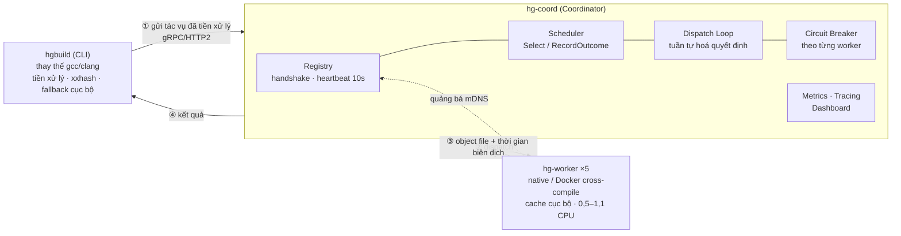
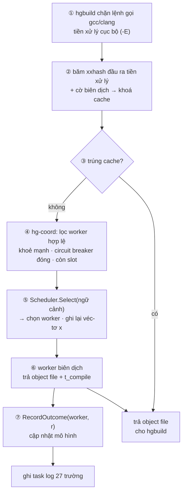
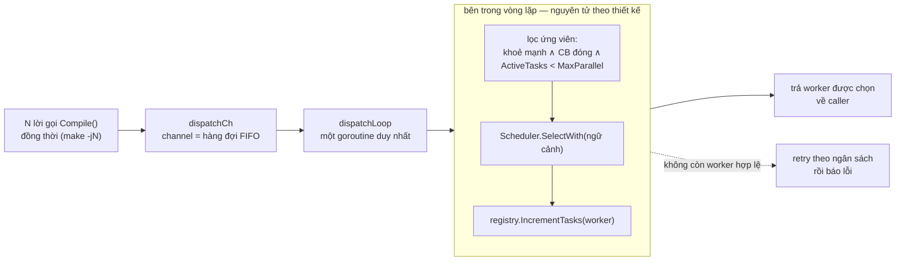

# Hybrid-Grid: Hệ thống biên dịch phân tán với lập lịch tác vụ dựa trên Contextual Bandit trên cụm máy không đồng nhất

**Lê Đức Hiếuᵃ, Nguyễn Trung Kiênᵃ, Nguyễn Trọng Khánhᵃ**

ᵃ *Học viện Công nghệ Bưu chính Viễn thông, Hà Nội, Việt Nam*

---

## Tóm tắt

Bài báo trình bày Hybrid-Grid, một hệ thống biên dịch phân tán mã nguồn mở cho C/C++ trên cụm worker không đồng nhất, và **HG-LinUCB** — thuật toán lập lịch học tăng cường trực tuyến mà chúng tôi đề xuất và đặt làm bộ lập lịch chính của hệ thống. Trong một hệ biên dịch phân tán, thành phần khó nhất không phải truyền tệp hay quản lý cache mà là *quyết định gửi mỗi đơn vị dịch tới worker nào*: bài toán $R||C_{\max}$ NP-khó, phải giải trực tuyến, trên các máy khác nhau tới 2,2 lần về năng lực và có phân phối thời gian biên dịch với tỉ số P99/P50 lên tới 26 lần. Chúng tôi phát biểu mỗi quyết định dispatch thành một bài toán contextual bandit với véc-tơ ngữ cảnh 12 chiều mô tả đồng thời tác vụ và worker, phần thưởng log-latency, và cập nhật trực tuyến Sherman–Morrison chi phí $O(d^2)$. Trên nền LinUCB, HG-LinUCB bổ sung hai cơ chế trực giao khắc phục hai chế độ thất bại mà bandit thuần bộc lộ khi chạy trên hệ thống thật: một **cửa sổ warm-start học thụ động** (bộ học quan sát và cập nhật mô hình trong khi nhường quyền quyết định cho heuristic) và một **thành phần phạt tải thời gian thực** $\lambda\cdot\text{LoadRatio}$ cộng vào điểm UCB. Chúng tôi cũng chỉ ra bốn yêu cầu triển khai mà nếu vi phạm sẽ khiến một LinUCB đúng sách vở trở thành bộ lập lịch tệ nhất trong hệ (158 s so với 94 s) — đáng chú ý nhất là bộ nhận diện năng lực mù cgroup âm thầm giữ hai trong mười hai chiều ngữ cảnh là hằng số trên mọi worker container hoá, một chế độ thất bại chúng tôi chưa thấy mô tả ở đâu khác. Đánh giá theo thiết kế khối ngẫu nhiên hoá đầy đủ (10 khối, kiểm định ghép cặp, hiệu chỉnh Holm) trên build sạch CPython cho thấy HG-LinUCB thắng LinUCB thuần 8,95 s và Power-of-Two-Choices 4,66 s với effect size lớn ($p = 0{,}003$), nhưng không tách được khỏi heuristic LeastLoaded (1,12 s, $p = 0{,}053$). Phép tái dựng tình trạng cụm tại từng thời điểm dispatch giải thích trọn vẹn cả hai kết quả bằng một cơ chế duy nhất: ở mức tải thường dùng, 100% quyết định đều có sẵn worker rảnh, nên hành vi duy nhất phân biệt các chính sách là chúng có bỏ qua worker rảnh hay không — HG-LinUCB 0,1% và LeastLoaded 0,0%, so với P2C 22,5% và LinUCB thuần 35,0%; khi đẩy cụm tới bão hoà, tỉ lệ dispatch còn worker rảnh giảm còn 33%, tỉ lệ bỏ qua tuyệt đối của hai chính sách hay bỏ qua giảm còn 5,4% và 7,1%, và cả bốn bộ lập lịch trở nên không phân biệt được về thống kê (Friedman $p = 0{,}375$). Kết quả khoanh vùng chính xác điều kiện để lập lịch nhận biết ngữ cảnh phát huy tác dụng, và cung cấp một phép chẩn đoán rẻ tiền để bất kỳ nghiên cứu lập lịch nào tự kiểm tra xem mình có đang thực sự đo lập lịch hay không.

**Từ khoá:** biên dịch phân tán; lập lịch tác vụ; contextual bandit; LinUCB; học trực tuyến; cụm không đồng nhất

---

## 1. Giới thiệu

Biên dịch phân tán là một thực tế thường nhật của kỹ nghệ phần mềm hiện đại. Các dự án C/C++ lớn như LLVM, Chromium hay nhân Linux chứa hàng chục nghìn đơn vị dịch (translation unit); một lần build sạch trên máy đơn có thể kéo dài hàng giờ. Các hệ thống như distcc [15], Bazel Remote Build Execution và Incredibuild giải quyết vấn đề bằng cách đẩy tác vụ biên dịch lên một bể worker từ xa. Bể worker này về bản chất là *không đồng nhất*: laptop của lập trình viên, máy chủ CI Linux, node ARM trên cloud, máy build chuyên dụng — khác nhau về số lõi CPU, bộ nhớ, kiến trúc tập lệnh và tải tức thời.

Khi xây dựng Hybrid-Grid, hệ thống biên dịch phân tán trình bày trong bài báo này, chúng tôi nhận thấy các thành phần thường được coi là khó — truyền mã nguồn tiền xử lý, cache nội dung định địa chỉ, khám phá worker, cách ly lỗi — đều có giải pháp kỹ thuật đã được hiểu rõ và, sau khi cài đặt, hoạt động ổn định. Thành phần thực sự khó là **bộ lập lịch**: hàm quyết định mỗi đơn vị dịch đi tới worker nào. Nó khó vì ba lý do đồng thời.

Thứ nhất, bài toán nền tảng khó về mặt lý thuyết. Gán tác vụ lên máy không đồng nhất để cực tiểu hoá makespan là bài toán $R||C_{\max}$ (unrelated parallel machines): NP-khó, không thể xấp xỉ tốt hơn tỉ lệ $3/2$ trừ khi P = NP, với cận trên xấp xỉ tốt nhất hiện biết là $2$ [1]. Thứ hai, nó phải được giải *trực tuyến*: tác vụ đến tuần tự và phải được gán ngay, không biết trước phần còn lại của luồng. List scheduling của Graham [2] đạt tỉ lệ cạnh tranh $2 - 1/m$ trên máy đồng nhất, nhưng với máy không đồng nhất không tồn tại cận cạnh tranh phổ quát chặt. Thứ ba, đo lường trên chính hệ thống của chúng tôi cho thấy môi trường có phương sai rất lớn: trên một build CPython (~295 tác vụ biên dịch mỗi build) qua cụm 5 worker không đồng nhất, tỉ số giữa phân vị P99 và P50 của thời gian biên dịch lên tới **26 lần** (gộp trên 11.800 tác vụ), và worker bận nhất trong một vòng hấp thụ **25–31% tổng số dispatch** dưới các heuristic tĩnh, so với 20% nếu chia đều.

Chính đặc điểm thứ ba gợi ý hướng tiếp cận của chúng tôi. Các heuristic mà hệ thống sản xuất dựa vào — round-robin, least-loaded, hoặc Power-of-Two-Choices (P2C) [3] — có chung một tính chất: mỗi quyết định chỉ là hàm của độ dài hàng đợi hoặc điểm năng lực tĩnh, và *kết quả của một lần dispatch không bao giờ quay lại tác động tới lần kế tiếp*. Trong một môi trường có phương sai lớn và cấu trúc không đồng nhất ổn định, một bộ lập lịch quan sát kết quả biên dịch và điều chỉnh quyết định tương lai — một bộ học trực tuyến — về nguyên tắc có thể làm tốt hơn.

Các tiếp cận học tăng cường sâu cho lập lịch đã công bố (Decima [12], DeepRM [11]) đều đòi hỏi huấn luyện trước trong trình mô phỏng, thứ không tồn tại cho hệ thống build với trình biên dịch thật và phần cứng nhiễu. Chúng tôi vì vậy chọn lớp thuật toán *contextual multi-armed bandit* [7, 8]: mỗi quyết định lập lịch là một bài toán một bước, học trực tuyến ngay trên hệ thống đang chạy từ phần thưởng quan sát được, không cần pha huấn luyện offline, với cận regret lý thuyết dạng $O(\sqrt{T})$ dưới giả thiết tuyến tính [10]. Thuật toán tiêu biểu của họ này là LinUCB [9].

Đóng góp trung tâm của bài báo là **HG-LinUCB**, biến thể LinUCB chúng tôi thiết kế riêng cho bài toán chọn worker và đặt làm bộ lập lịch chính của Hybrid-Grid. Việc đưa một bandit sách vở vào hệ thống thật bộc lộ hai chế độ thất bại mang tính cấu trúc mà lý thuyết không nói tới: *cold start* — trong các dispatch đầu tiên mô hình chưa có thông tin nên quyết định gần như ngẫu nhiên, mà một build chỉ kéo dài vài trăm quyết định; và *phản hồi trễ* — phần thưởng chỉ về sau khi biên dịch xong, trong cửa sổ vài giây đó bandit không biết mình vừa dồn việc vào một worker và tiếp tục dồn thêm. HG-LinUCB khắc phục cả hai bằng hai cơ chế trực giao: một cửa sổ warm-start trong đó bộ học *quan sát và cập nhật mô hình nhưng nhường quyền quyết định* cho heuristic, và một thành phần phạt tải thời gian thực cộng vào điểm UCB, đóng vai trò prior thủ công chặn hành vi dồn việc trước khi mô hình tích đủ dữ liệu để tự nhận ra. Tên thuật toán đặt theo tên hệ thống: HG-LinUCB là bản LinUCB mà Hybrid-Grid chạy. Thứ hai cơ chế cùng tạo ra là một điểm số ghép từ ba thành phần có nguồn gốc khác nhau — giá trị *đã học* từ ngữ cảnh, cộng bonus *khám phá*, trừ tín hiệu *tức thời* mà chỉ heuristic mới có.

Đóng góp cụ thể của nghiên cứu gồm:

- **C1.** **HG-LinUCB** (Mục 5): công thức hoá quyết định dispatch thành contextual bandit với véc-tơ ngữ cảnh 12 chiều mô tả đồng thời tác vụ và worker, cùng hai cơ chế warm-start học thụ động và phạt tải thời gian thực. Thiết kế thắng LinUCB thuần 8,95 s và P2C 4,66 s với effect size lớn dưới quy trình đánh giá chặt.
- **C2.** **Bốn yêu cầu triển khai** để một contextual bandit hoạt động được trên cụm container hoá (Mục 5.7), kèm chi phí đo được của việc vi phạm từng cái — trong đó có bộ nhận diện năng lực mù cgroup âm thầm làm suy biến hai chiều ngữ cảnh trên bất kỳ cụm Docker/Kubernetes nào có quota khác nhau, một chế độ thất bại không sinh lỗi, không làm fail test nào, và chúng tôi chưa thấy được mô tả ở đâu khác.
- **C3.** **Hybrid-Grid** (Mục 3): hệ thống biên dịch phân tán mã nguồn mở hoàn chỉnh viết bằng Go — CLI `hgbuild` thay thế trực tiếp gcc/clang, coordinator `hg-coord` với registry, đường dispatch tuần tự hoá, circuit breaker theo từng worker và dashboard thời gian thực, worker `hg-worker` hỗ trợ thực thi native và Docker cross-compile; gRPC/HTTP2 với TLS/mTLS tuỳ chọn, tự khám phá qua mDNS, cache nội dung định địa chỉ bằng xxhash, khả năng quan sát đầy đủ (Prometheus, OpenTelemetry).
- **C4.** **Đánh giá có kiểm soát nhiễu** (Mục 7): thiết kế khối ngẫu nhiên hoá đầy đủ 10 khối với kiểm định ghép cặp và hiệu chỉnh Holm, ở hai mức đồng thời dispatch, phân tích bốn bộ lập lịch liên quan trực tiếp tới câu hỏi nghiên cứu trong số sáu bộ cùng cài đặt sau một giao diện thống nhất.
- **C5.** **Phân tích cơ chế ở cấp từng dispatch** (Mục 7.4): phép tái dựng tình trạng worker tại mọi thời điểm quyết định, cho thấy toàn bộ chênh lệch đo được giữa các bộ lập lịch quy về đúng một hành vi. Đây đồng thời là một phép chẩn đoán rẻ tiền để mọi nghiên cứu lập lịch tự kiểm tra xem điểm vận hành của mình có thực sự cho phép phân biệt các chính sách hay không.

Phần còn lại của bài báo được tổ chức như sau. Mục 2 điểm lại công trình liên quan. Mục 3 mô tả kiến trúc và các bước vận hành của Hybrid-Grid. Mục 4 phát biểu bài toán lập lịch và mô hình hoá nó dưới khung contextual bandit. Mục 5 — phần trọng tâm — trình bày thiết kế HG-LinUCB. Mục 6 mô tả năm bộ lập lịch đối chứng. Mục 7 trình bày đánh giá thực nghiệm. Mục 8 thảo luận, Mục 9 kết luận.

## 2. Công trình liên quan

### 2.1. Lập lịch heuristic trên máy không đồng nhất

Bài toán $R||C_{\max}$ được Lenstra, Shmoys và Tardos [1] chứng minh NP-khó với cận dưới xấp xỉ $3/2$ và thuật toán xấp xỉ tỉ lệ $2$; khoảng cách này vẫn mở sau hơn 35 năm. Trong thực hành, Power-of-Two-Choices [3] là heuristic nổi bật: lấy mẫu ngẫu nhiên hai server và chọn server ít tải hơn giảm tải cực đại từ $\Theta(\log n / \log\log n)$ xuống $\Theta(\log\log n)$ trên cụm đồng nhất. Sparrow [4] mở rộng P2C với late binding cho lập lịch phi tập trung độ trễ thấp. HEFT [5] là thuật toán kinh điển cho DAG tác vụ trên máy không đồng nhất, xếp hạng tác vụ theo upward rank và gán theo thời gian hoàn thành sớm nhất; chúng tôi điều chỉnh HEFT cho luồng tác vụ trực tuyến bằng ước lượng EWMA thời gian biên dịch. Điểm chung của cả nhóm: quyết định dựa trên trạng thái hàng đợi hoặc năng lực tĩnh, không bao giờ dựa trên kết quả từng tác vụ.

### 2.2. Multi-armed bandit và contextual bandit

Khung bandit cổ điển với ε-greedy và cập nhật trung bình mẫu được trình bày hệ thống trong Sutton và Barto [6]; UCB1 của Auer và cộng sự [16] đưa nguyên lý "lạc quan trước bất định" vào chọn cánh tay. Slivkins [7] và Lattimore–Szepesvári [8] hệ thống hoá lý thuyết regret. LinUCB [9] mở rộng sang thiết lập có ngữ cảnh: mỗi cánh tay duy trì mô hình tuyến tính $(A_a, b_a)$, chọn cánh tay theo điểm $\hat{\theta}_a^\top x + \alpha\sqrt{x^\top A_a^{-1} x}$. Cận regret $\tilde{O}(\sqrt{Td})$ được chứng minh cho biến thể SupLinUCB [10]; đáng chú ý là bound này *không* áp dụng trực tiếp cho LinUCB Algorithm 1 mà các hệ thống thực (kể cả chúng tôi) triển khai — một điểm chúng tôi trình bày trung thực ở Mục 8.3.

### 2.3. Học máy cho lập lịch hệ thống

Decima [12] dùng mạng nơ-ron đồ thị với REINFORCE để lập lịch job Spark, đạt cải thiện tới 1,5× thời gian hoàn thành job, nhưng đòi hỏi hàng nghìn episode huấn luyện trong trình mô phỏng trước khi triển khai. DeepRM [11] là công trình sớm nhất áp policy-gradient cho quản lý tài nguyên, cũng phụ thuộc mô phỏng. Quasar [13] dùng collaborative filtering (học có giám sát, không có exploration) để dự đoán hiệu năng job trên từng loại máy. Resource Central [14] dùng random forest dự đoán vòng đời VM trong Azure — học có giám sát offline ở quy mô sản xuất. Khoảng trống mà nghiên cứu này nhắm đến: *học trực tuyến, không cần mô phỏng, áp dụng cụ thể cho biên dịch phân tán* — theo hiểu biết của chúng tôi, chưa có công bố nào áp contextual bandit cho bài toán này và mô tả các cạm bẫy triển khai phát sinh khi tương tác với phân phối độ trễ biên dịch thật.

### 2.4. Hệ thống build phân tán

Các hệ thống build sản xuất chia ba lớp: hệ *cache-first* (ccache, sccache, Bazel RBE) ưu tiên tra cứu cache theo hash, chọn worker bằng round-robin hoặc least-loaded; hệ *chấm điểm năng lực* (distcc [15]) xếp hạng worker theo năng lực tĩnh; hệ *nhận thức DAG* (Bazel, Buck2) dùng đồ thị build để trì hoãn quyết định nhưng trong mỗi lớp DAG vẫn lập lịch theo năng lực. Phần lớn không thích ứng theo kết quả thực thi quan sát được, tuy điều này không tuyệt đối: Buildbarn [22] chẳng hạn học kết quả phân lớp kích thước theo từng action-digest xuyên suốt các build bằng một bộ phân tích kiểu PageRank được lưu bền (`InitialSizeClassCache`), phục vụ dự đoán lớp tài nguyên chứ không phải chọn worker. Điều chúng tôi chưa tìm thấy ở bất kỳ hệ build sản xuất nào là việc chọn worker được đặt thành bài toán contextual bandit theo từng quyết định với tín hiệu phần thưởng tường minh và lập luận về regret — đây chính là khoảng trống bài báo này nhắm tới. Các công trình gần nhất dùng ML offline dự đoán thời gian tác vụ rồi dispatch bằng heuristic trên dự đoán đó: lập lịch bằng học có giám sát, không phải bandit.

## 3. Hệ thống Hybrid-Grid

### 3.1. Kiến trúc

Hệ thống gồm ba thành phần giao tiếp qua gRPC trên HTTP/2 (tuỳ chọn TLS/mTLS):

- **`hgbuild` (CLI):** thay thế trực tiếp gcc/clang, đồng thời bọc `make`/`ninja`. Nó tiền xử lý mã nguồn cục bộ, băm đầu ra tiền xử lý bằng xxhash để tra cứu cache, gửi tác vụ tới coordinator, và tự động *rơi về* biên dịch cục bộ khi coordinator không sẵn sàng — nên một lỗi hạ tầng làm build chậm đi chứ không làm build hỏng.
- **`hg-coord` (Coordinator):** bộ điều phối trung tâm, gồm registry worker (đăng ký handshake gRPC, heartbeat 10 giây), **bộ lập lịch** (đối tượng nghiên cứu chính, Mục 4–6), đường dispatch tuần tự hoá (Mục 3.3), circuit breaker theo từng worker để cô lập lỗi, Prometheus metrics, OpenTelemetry tracing, và dashboard WebSocket thời gian thực.
- **`hg-worker` (Worker):** thực thi biên dịch theo hai chế độ — native (gọi gcc/clang trực tiếp) hoặc Docker (cross-compile qua ảnh dockcross); duy trì cache nội dung định địa chỉ cục bộ (tăng tốc ~10× khi trúng cache); tự quảng bá qua mDNS để khám phá không cần cấu hình.



**Hình 1.** Kiến trúc Hybrid-Grid. `hgbuild` gửi tác vụ đã tiền xử lý tới `hg-coord`; bộ lập lịch chọn một trong năm worker không đồng nhất; kết quả kèm thời gian biên dịch chảy ngược lại, vừa trả cho client vừa trở thành tín hiệu phần thưởng cho bộ lập lịch học.

Ngoài đường C/C++ là trọng tâm, hệ thống còn hỗ trợ build Flutter Android phân tán và dịch cờ GCC/Clang sang MSVC; các đường này không đi qua bộ lập lịch học nên nằm ngoài phạm vi đánh giá.

### 3.2. Vòng đời một tác vụ biên dịch

Bảy bước dưới đây là đường đi đầy đủ của một đơn vị dịch, và là bối cảnh cần thiết để hiểu bộ lập lịch nhìn thấy gì, tại thời điểm nào.



**Hình 2.** Vòng đời một đơn vị dịch. Bộ lập lịch chỉ tham gia ở bước ⑤, và chỉ nhìn thấy trạng thái cụm *tại đúng thời điểm đó*; phần thưởng của quyết định này chỉ quay về ở bước ⑦, sau khi biên dịch xong — độ trễ đó chính là chế độ thất bại "phản hồi trễ" mà Mục 5.5 xử lý.

Hai đặc điểm của vòng đời này định hình toàn bộ thiết kế thuật toán ở Mục 5. Thứ nhất, giữa bước ⑤ và ⑦ có một khoảng trễ bằng đúng thời gian biên dịch (P50 khoảng vài trăm mili-giây, P99 tới 5–8 giây), và trong khoảng đó có thể có hàng chục quyết định khác được đưa ra mà chưa quyết định nào trong nhóm nhận được phần thưởng. Thứ hai, mỗi build sạch chỉ phát sinh 295 quyết định — một chân trời rất ngắn cho một bộ học trực tuyến, khiến hiệu quả mẫu ở giai đoạn đầu quan trọng hơn hành vi tiệm cận.

### 3.3. Đường dispatch của coordinator

Bước ④–⑤ trong Hình 2 phải chịu được nhiều lời gọi `Compile()` đồng thời: với cờ `make -jN`, có tới $N$ tác vụ cùng lúc yêu cầu một quyết định. Quyết định lập lịch đọc trạng thái worker (`ActiveTasks`) và việc dispatch ghi lại trạng thái đó; nếu hai bước là hai thao tác tách rời giữa các goroutine đồng thời, hai dispatch có thể cùng đọc một giá trị `ActiveTasks` cũ, cùng chọn một worker năng lực thấp và gây overbook.

Hybrid-Grid vì vậy tuần tự hoá toàn bộ đường quyết định qua **một goroutine `dispatchLoop` duy nhất**, sở hữu mọi cặp `SelectWith`+`IncrementTasks` trong suốt vòng đời coordinator. Mỗi lời gọi `Compile()` gửi yêu cầu vào một channel `dispatchCh` rồi chờ kết quả. Chúng tôi dùng channel của Go chứ không tự cài hàng đợi, vì channel vốn đã *là* một hàng đợi FIFO đồng bộ, còn một linked list thủ công bị nhiều goroutine chạm vào chỉ dời chỗ chứ không xoá bỏ yêu cầu khoá tương tự.



**Hình 3.** Đường dispatch tuần tự hoá. Việc đọc trạng thái worker, chọn worker và ghi nhận dispatch nằm gọn trong một goroutine duy nhất, nên chúng là nguyên tử với nhau theo thiết kế mà không cần khoá tường minh.

Bộ lọc ứng viên chạy *trước* bộ lập lịch và là bất biến chung cho cả sáu bộ lập lịch: worker phải khoẻ mạnh, circuit breaker của nó phải đang đóng, và nó phải còn slot (`ActiveTasks < MaxParallel`). Nhờ vậy mọi bộ lập lịch, kể cả các heuristic đơn giản nhất, không bao giờ có thể chọn một worker đã đầy tải. Chúng tôi xác minh tính đúng đắn của đường dispatch bằng một test hồi quy đồng thời chuyên biệt: 5 worker với `MaxParallel = 1` mỗi worker, 40 đợt gồm 5 chu kỳ dispatch-và-giải-phóng đồng thời, một bộ đếm atomic độc lập khẳng định không worker nào từng bị giữ vượt năng lực; test sạch qua 20 lần chạy lặp lại.

Khi mọi worker đều đầy, `SelectWith` trả về `ErrNoMatchingWorkers` và coordinator retry theo một ngân sách có giới hạn (`maxDispatchAttempts = 8`, backoff `attempt × 25 ms`, tổng khoảng 700 ms) trước khi báo lỗi. Đây là một hạn chế thiết kế đã biết mà chúng tôi ghi nhận thẳng thắn: ngân sách này được đặt dựa trên giả định thời gian biên dịch nằm trong khoảng ~10–500 ms, trong khi P99 đo được trên workload của chúng tôi là 5–8 giây — sai từ mười đến vài trăm lần. Hệ quả là coordinator chịu được tải tới đúng tổng năng lực cụm nhưng không có backpressure thật cho quá tải bền vững; chúng tôi trở lại điểm này ở Mục 7.1 và 8.3.

### 3.4. Khả năng quan sát và task log

Mỗi lời gọi `Compile()` hoàn tất phát sinh một bản ghi JSON Lines 27 trường qua `TaskLogger`: định danh (task, loại build, scheduler), **ngữ cảnh worker tại thời điểm dispatch** (lõi, RAM, kiến trúc, số tác vụ đang chạy, nguồn khám phá), đặc tả tác vụ (kích thước nguồn thô và tiền xử lý, kiến trúc đích), phân rã độ trễ (queue / compile / RPC / tổng), kết cục (thành công, exit code, trúng cache), và introspection của bộ học (Q-value tại dispatch, cờ exploration). File nạp thẳng vào pandas bằng `read_json(lines=True)`.

Việc ghi ngữ cảnh *tại thời điểm dispatch* chứ không phải tại thời điểm hoàn tất là một quyết định thiết kế có chủ đích, và chính nó làm cho phân tích cơ chế ở Mục 7.4 trở nên khả thi: từ cặp (thời điểm dispatch, tổng thời gian tác vụ) của mọi tác vụ, ta tái dựng được chính xác cụm đang ở trạng thái nào khi từng quyết định được đưa ra.

## 4. Bài toán lập lịch

### 4.1. Phát biểu

Cho tập worker $\mathcal{W} = \{1,\dots,m\}$ không đồng nhất và một luồng tác vụ biên dịch $1,2,\dots,T$ đến tuần tự. Tác vụ $t$ có thời gian thực thi $p_{t,a}$ phụ thuộc worker $a$ được gán, không biết trước và chỉ quan sát được sau khi hoàn tất. Bộ lập lịch phải chọn $a_t \in \mathcal{W}_t$ ngay khi tác vụ $t$ đến, trong đó $\mathcal{W}_t$ là tập ứng viên đã lọc ở Mục 3.3. Mục tiêu là cực tiểu hoá makespan $C_{\max} = \max_a \sum_{t: a_t = a} p_{t,a}$ — với ràng buộc mỗi worker $a$ chỉ chạy được tối đa `MaxParallel`$_a$ tác vụ đồng thời.

Cụm đánh giá của chúng tôi có $m = 5$ và tổng $\sum_a$ `MaxParallel`$_a = 10$ slot; năng lực CPU chia không đều 0,5 / 0,6 / 0,8 / 1,0 / 1,1 lõi, tức chênh lệch **2,2 lần** giữa worker mạnh nhất và yếu nhất.

### 4.2. Vì sao chọn khung contextual bandit

Ba tính chất của bài toán quyết định lựa chọn mô hình.

*Có ngữ cảnh phong phú tại thời điểm quyết định.* Coordinator biết kích thước nguồn tiền xử lý, ngôn ngữ, kiến trúc đích, và với mỗi worker: năng lực CPU/RAM, độ sâu hàng đợi hiện tại, độ trễ RPC gần đây, lịch sử thành công. Đây chính xác là thiết lập mà contextual bandit được thiết kế cho, và là thứ mà cả ε-greedy mù đặc trưng lẫn các heuristic tĩnh đều bỏ phí.

*Phần thưởng quan sát được trực tiếp.* Thời gian biên dịch do worker báo về là một tín hiệu vô hướng, sạch, không cần gán tín dụng qua nhiều bước.

*Ghép nối giữa các quyết định là yếu.* Các tác vụ biên dịch gần như độc lập; khi đặc trưng độ sâu hàng đợi đã nằm trong véc-tơ ngữ cảnh, phần ghép nối trạng thái còn lại giữa các quyết định liên tiếp là nhỏ [7]. Một MDP đầy đủ sẽ đòi hỏi quy hồi makespan về từng quyết định dispatch — bài toán credit assignment với phần thưởng thưa qua hàng trăm bước, chính là chế độ mà các phương pháp policy-gradient cần trình mô phỏng [11, 12] mà chúng tôi chủ đích không có.

### 4.3. Mô hình hoá

Tại thời điểm quyết định $t$, coordinator quan sát véc-tơ ngữ cảnh $x_{t,a} \in \mathbb{R}^d$ cho mỗi worker hợp lệ $a \in \mathcal{W}_t$, chọn hành động $a_t$, dispatch tác vụ, và khi tác vụ hoàn tất nhận phần thưởng vô hướng

$$r_t = -\log\bigl(1 + t_{\text{compile}}^{(t)}\bigr),$$

trong đó $t_{\text{compile}}^{(t)}$ là thời gian biên dịch do worker báo cáo (mili-giây). Phép biến đổi log là lựa chọn kỹ nghệ nhằm nén đuôi nặng của phân phối (P99/P50 ≈ 26×): không nén, một outlier 24 giây sẽ áp đảo các cập nhật của mô hình. Tác vụ thất bại (timeout, lỗi worker) nhận $r = -\log(1 + T_{\text{timeout}})$, với $T_{\text{timeout}} = 5$ phút, chính là hạn chót tác vụ đặt ở phía client — trường hợp xấu nhất hệ thống có thể quan sát — để bộ học tự động hạ giá worker hỏng dai dẳng mà không cần luật xử lý lỗi riêng. Chúng tôi lưu ý trung thực rằng dạng phần thưởng này không có nguồn peer-review trực tiếp; dạng có biện luận lý thuyết gần nhất là phần thưởng tích phân thời gian của Decima [12].

Giao diện `Scheduler` của hệ thống cung cấp `Select(buildType, arch, clientOS) → (Worker, error)`. Giao diện mở rộng `LearningScheduler` thêm `SelectWithDispatchInfo` (trả kèm Q-value và cờ exploration để ghi log) và `RecordOutcome(workerID, reward, success)`. Handler `Compile()` dùng type assertion để chỉ phản hồi phần thưởng khi bộ học được cấu hình, nên các heuristic không phải sửa đổi gì. Khung này là nền chung cho cả sáu bộ lập lịch.

## 5. HG-LinUCB: bộ lập lịch học tăng cường đề xuất

Đây là đóng góp thuật toán trung tâm của bài báo. Mục 5.1–5.2 xây nền LinUCB và thiết kế ngữ cảnh; Mục 5.3 chỉ ra hai chế độ thất bại của bandit thuần trên hệ thống thật; Mục 5.4–5.6 trình bày hai cơ chế khắc phục và thuật toán hoàn chỉnh; Mục 5.7 nêu bốn yêu cầu triển khai bắt buộc.

### 5.1. Nền tảng: LinUCB disjoint cho bài toán chọn worker

Chúng tôi ánh xạ mỗi worker thành một *cánh tay* (arm) và dùng mô hình disjoint của Li và cộng sự [9]: mỗi worker $a$ có bộ tham số riêng, không chia sẻ. Với mỗi $a$, duy trì $A_a \in \mathbb{R}^{d\times d}$ khởi tạo $I_d$ và $b_a \in \mathbb{R}^d$ khởi tạo $\mathbf{0}$; ước lượng ridge-regression hiện hành là $\hat{\theta}_a = A_a^{-1} b_a$. Tại vòng $t$, điểm UCB của mỗi worker hợp lệ là

$$p_{t,a} = \underbrace{\hat{\theta}_a^\top x_{t,a}}_{\text{giá trị kỳ vọng đã học}} + \underbrace{\alpha\sqrt{x_{t,a}^\top A_a^{-1}\, x_{t,a}}}_{\text{bonus khám phá}},$$

chọn $a_t = \arg\max_a p_{t,a}$, và khi phần thưởng về thì cập nhật $A_{a_t} \leftarrow A_{a_t} + xx^\top$, $b_{a_t} \leftarrow b_{a_t} + rx$.

Mô hình disjoint phù hợp với bài toán này: các worker là những máy vật lý khác nhau về bản chất, và ta *muốn* mô hình học được rằng một tác vụ C++ lớn hành xử khác nhau trên worker 0,5 CPU so với worker 1,1 CPU — chia sẻ tham số sẽ làm nhoè chính sự khác biệt cần khai thác. Cái giá là mỗi worker cần dữ liệu riêng để làm ấm, và đó là một trong hai vấn đề mà Mục 5.3 nêu ra.

Một lưu ý về thuật ngữ, vì đây là chỗ rất dễ nhầm. Chúng tôi dùng Algorithm 1 của Li và cộng sự — mô hình *disjoint* — xuyên suốt bài. Algorithm 2 của họ mang tên *hybrid linear model* và là một cấu trúc khác hẳn: nó thêm một véc-tơ hệ số $\beta^*$ **dùng chung cho mọi cánh tay** bên cạnh $\theta_a$ riêng từng cánh tay. Chúng tôi không dùng mô hình đó. Chữ "HG" trong HG-LinUCB là viết tắt của Hybrid-Grid, tức tên hệ thống, và không hàm ý gì về lớp mô hình.

### 5.2. Thiết kế véc-tơ ngữ cảnh ($d = 12$)

Véc-tơ ngữ cảnh $x_{t,a}$ mô tả *cặp* (tác vụ, worker) — đây là điểm phân biệt cốt lõi với ε-greedy, vốn chỉ có một giá trị $Q(a)$ cho mỗi worker bất kể tác vụ là gì. Bảng 1 liệt kê bố cục cùng công thức chuẩn hoá; mọi đặc trưng được đưa xấp xỉ về $[0,1]$ để giữ $\|x\|$ bị chặn, theo quy ước tuyến tính của [10].

**Bảng 1.** Véc-tơ ngữ cảnh 12 chiều của HG-LinUCB. Chiều 1–3, 9–10 mô tả tác vụ; chiều 4–8, 11 mô tả worker và trạng thái tức thời của nó.

| # | Đặc trưng | Nguồn | Chuẩn hoá |
|---|---|---|---|
| 0 | bias | — | hằng số 1,0 |
| 1 | log kích thước nguồn tiền xử lý | tác vụ | $\log(1+s)/\log(1+4\,\text{MiB})$, chặn 1 |
| 2 | kiến trúc đích = x86_64 | tác vụ | one-hot 0/1 |
| 3 | kiến trúc đích = arm64 | tác vụ | one-hot 0/1 |
| 4 | năng lực CPU worker (thang log) | worker | $\log(1+m)/\log(1+16000)$, $m$ là milli-core cgroup nếu phát hiện được, ngược lại cores×1000 |
| 5 | bộ nhớ worker (thang log) | worker | $\log(1+b)/\log(1+64\,\text{GiB})$, $b$ tính bằng byte |
| 6 | kiến trúc native khớp đích | cặp | 0/1 |
| 7 | áp lực hàng đợi (LoadRatio) | worker, tức thời | active_tasks/max_parallel, chặn 1 |
| 8 | độ trễ RPC gần đây | worker, tức thời | ms/100, chặn 1 |
| 9 | tác vụ là C++ | tác vụ | 0/1 |
| 10 | log kích thước nguồn thô | tác vụ | $\log(1+s_{\text{raw}})/\log(1+1\,\text{MiB})$, chặn 1 |
| 11 | tỉ lệ thành công (Laplace) | worker, lịch sử | $(s+1)/(s+f+2)$ |

Hai nguyên tắc chi phối thiết kế này, cả hai đều rút ra từ các phiên bản không hoạt động được.

**Không chiều nào được phép trùng tuyến tính với chiều khác.** Thiết kế ban đầu có thêm một one-hot ba chiều cho loại build (CPP / Flutter / Unity); vì đường `Compile()` hiện chỉ phát sinh CPP, cột CPP trùng khít với bias và hai cột còn lại vĩnh viễn bằng 0. Ba chiều chết này làm $A_a$ suy biến theo hướng tương ứng và không đóng góp thông tin nào; chúng tôi loại bỏ chúng. Tương tự, đặc trưng tỉ lệ thành công nếu dùng dạng thô với prior lạc quan sẽ bằng đúng 1,0 cho mọi worker trên một workload thành công hoàn toàn — lại trùng với bias — nên chúng tôi áp Laplace smoothing để cột luôn phụ thuộc kinh nghiệm thực.

**Mọi chiều mô tả worker phải thực sự biến thiên giữa các worker.** Chiều 4 và 5 tồn tại để bandit phân biệt được năng lực phần cứng, và chúng chỉ làm được điều đó nếu nguồn dữ liệu phản ánh năng lực *của container*, không phải của host. Đây là yêu cầu triển khai nghiêm ngặt nhất trong toàn hệ thống và chúng tôi trình bày riêng ở Mục 5.7.

Một lưu ý về chính cụm của chúng tôi, xuất phát từ nguyên tắc thứ nhất. Docker Compose cấp bộ nhớ cho mỗi worker tỉ lệ thuận với quota CPU của nó, nên trên cụm này chiều 4 và chiều 5 gần như trùng nhau hoàn toàn sau chuẩn hoá ($r = 0{,}99999$ trên năm worker). Thiết kế cho phép hai trục biến thiên độc lập — một cụm có node ít lõi nhưng nhiều RAM sẽ khai thác được điều đó — nhưng đánh giá của chúng tôi thì không: trên thực tế bandit chỉ nhìn thấy một trục năng lực chứ không phải hai. Ridge regularisation vẫn giữ $A_a$ khả nghịch và không kết quả nào phụ thuộc vào việc hai chiều này tách biệt, nhưng chúng tôi ghi nhận điều đó thay vì để Bảng 1 ngụ ý mười hai chiều đều mang thông tin độc lập.

### 5.3. Hai chế độ thất bại của bandit thuần trên hệ thống thật

Với ngữ cảnh đã thiết kế đúng, LinUCB chuẩn vẫn bộc lộ hai vấn đề mang tính cấu trúc khi chạy trong Hybrid-Grid. Cả hai đều là hệ quả trực tiếp của vòng đời tác vụ ở Hình 2, chứ không phải khiếm khuyết của thuật toán.

**(F1) Cold start trên chân trời quá ngắn.** Ngay sau khi khởi tạo, $A_a = I_d$ và $b_a = \mathbf{0}$, nên $\hat\theta_a = \mathbf{0}$ và điểm UCB rút gọn về thuần bonus khám phá — quyết định gần như ngẫu nhiên. Với bandit trong quảng cáo trực tuyến, giai đoạn này không đáng kể trên hàng triệu lượt hiển thị. Với chúng tôi, một build sạch chỉ có 295 quyết định, và coordinator thường khởi động lại giữa các build; một pha ngẫu nhiên kéo dài vài chục quyết định đã là vài phần trăm của toàn bộ makespan bị tiêu phí.

**(F2) Phản hồi trễ gây dồn việc.** Phần thưởng chỉ về ở bước ⑦, sau khi biên dịch xong. Trong cửa sổ đó — dài bằng thời gian biên dịch, tới 5–8 giây ở P99 — mô hình của một worker vẫn giữ nguyên như trước khi nó nhận tác vụ. Nếu $\hat\theta_a$ hiện đánh giá worker $a$ là tốt nhất, bandit sẽ chọn nó lặp lại cho mọi quyết định trong cửa sổ đó, dồn hàng chục tác vụ lên một máy trước khi bất kỳ tín hiệu tiêu cực nào kịp quay về. Đặc trưng LoadRatio ($x[7]$) *về nguyên tắc* mã hoá được tình trạng này, nhưng mô hình chỉ dùng được nó sau khi đã học được trọng số âm cho nó — tức sau khi đã trả giá cho hành vi dồn việc nhiều lần.

Hai chế độ này có bản chất khác nhau — một là thiếu dữ liệu, một là thiếu độ tươi của dữ liệu — nên chúng tôi khắc phục bằng hai cơ chế trực giao, mỗi cơ chế có một tham số cấu hình riêng và có thể tắt độc lập.

### 5.4. Cơ chế 1 — Cửa sổ warm-start học thụ động

Trong $N$ dispatch đầu tiên (mặc định $N = 100$, cấu hình qua `--warm-start`), quyết định được giao cho heuristic least-loaded: chọn worker có `ActiveTasks` nhỏ nhất trong tập ứng viên đã lọc. Nhưng bộ học **không** ngồi im. Nó vẫn tính véc-tơ ngữ cảnh $x$ của worker được chọn, vẫn lưu $x$ theo TaskID, và khi phần thưởng về vẫn thực hiện cập nhật Sherman–Morrison bình thường.

Điểm mấu chốt là *bộ học học từ dữ liệu do một chính sách khác sinh ra*. Đây là học ngoài chính sách ở dạng đơn giản nhất: heuristic least-loaded đóng vai trò một chính sách hành vi an toàn, sinh ra các cặp (ngữ cảnh, phần thưởng) trải trên mọi worker — và trải khá đều, vì bản chất của least-loaded là phân phối tác vụ. Sau $N$ dispatch, bandit tiếp quản với $A_a$ và $b_a$ đã được làm ấm bằng quan sát thật thay vì bằng prior rỗng.

Việc chọn $N = 100$ cho một build 295 tác vụ là một đánh đổi có chủ đích: khoảng một phần ba số quyết định đầu dành cho thu thập dữ liệu an toàn, hai phần ba còn lại cho chính sách đã học. Vì $N < 295$, bandit hội tụ *ngay trong* một build đơn lẻ, không phụ thuộc trạng thái từ các build trước — một tính chất chúng tôi kiểm chứng thực nghiệm ở Mục 7.5.

### 5.5. Cơ chế 2 — Điểm kết hợp với phạt tải thời gian thực

Sau warm-start, điểm chọn worker không còn là điểm UCB thuần mà là

$$Q_{\text{HG}}(a) = \underbrace{\hat{\theta}_a^\top x}_{\text{giá trị đã học}} \;+\; \underbrace{\alpha\sqrt{x^\top A_a^{-1} x}}_{\text{bonus khám phá}} \;-\; \underbrace{\lambda \cdot \text{LoadRatio}_a}_{\text{phạt quá tải tức thời}},$$

với $\lambda$ mặc định 0,5, cấu hình qua `--load-penalty`.

Thành phần thứ ba chính là thứ tách HG-LinUCB khỏi bandit thuần. LoadRatio vốn đã là đặc trưng $x[7]$, nên về lý thuyết LinUCB có thể tự học một trọng số âm cho nó — và cuối cùng nó sẽ học được. Thành phần phạt hoạt động như một **prior thủ công** áp đặt sẵn kiến thức mà chúng tôi biết chắc là đúng, dùng thông tin *thời gian thực* (đếm tác vụ đang chạy, cập nhật theo mili-giây tại thời điểm dispatch, y như LeastLoaded) thay vì thông tin đã học *chậm* qua phần thưởng trễ. Nói cách khác: bandit cung cấp thứ heuristic không có (hiểu biết về cặp tác vụ–worker), còn phạt tải cung cấp thứ bandit không có (trạng thái hàng đợi tại đúng lúc này). Đây chính là cơ chế đối trị trực tiếp với (F2).

Chúng tôi ràng buộc $\lambda \in [0, 5]$: $\lambda$ quá lớn khiến số hạng phạt áp đảo mọi ước lượng đã học và thuật toán thoái hoá về LeastLoaded thuần. Ở đầu kia, khi $\lambda = 0$ *và* $N = 0$, hành vi trùng từng bit với LinUCB thuần — cả hai bộ lập lịch dùng chung một code path, chỉ khác cấu hình, nên phép so sánh giữa chúng ở Mục 7 cô lập đúng đóng góp của hai cơ chế chứ không lẫn khác biệt triển khai nào.

### 5.6. Thuật toán hoàn chỉnh và độ phức tạp

```
Thuật toán 1: HG-LinUCB (một quyết định dispatch)
─────────────────────────────────────────────────────────────
Tham số: α (bonus khám phá), N (cửa sổ warm-start), λ (hệ số phạt tải)
Trạng thái mỗi worker a: A_a ∈ R^{d×d} (khởi tạo I_d), b_a ∈ R^d (khởi tạo 0),
                          A_a^{-1} được cache; n = số dispatch đã thực hiện

SELECT(tác vụ τ, tập ứng viên W_t):
  1  nếu |W_t| = 1:  trả về worker duy nhất            ▷ fast-path, bỏ qua đại số ma trận
  2  với mỗi a ∈ W_t:  x_a ← BuildContext(τ, a)        ▷ Bảng 1; đọc trạng thái TẠI ĐÂY
  3  nếu n < N:                                        ▷ Cơ chế 1: warm-start thụ động
  4      a* ← argmin_{a ∈ W_t} ActiveTasks(a)
  5  ngược lại:                                        ▷ Cơ chế 2: điểm kết hợp
  6      với mỗi a ∈ W_t:
  7          θ̂_a ← A_a^{-1} b_a
  8          Q_a ← θ̂_aᵀ x_a + α·sqrt(x_aᵀ A_a^{-1} x_a) − λ·LoadRatio(a)
  9      a* ← argmax_{a ∈ W_t} Q_a
 10  pendingContext[τ.ID] ← x_{a*}                     ▷ đóng băng ngữ cảnh của quyết định
 11  n ← n + 1;  trả về a*

RECORDOUTCOME(τ, worker a, thời gian biên dịch t_c, thành công):
 12  x ← pendingContext[τ.ID];  xoá khỏi bảng
 13  r ← −log(1 + t_c)   nếu thành công,  ngược lại  −log(1 + T_timeout)
 14  b_a ← b_a + r·x
 15  A_a^{-1} ← A_a^{-1} − (A_a^{-1} x xᵀ A_a^{-1}) / (1 + xᵀ A_a^{-1} x)   ▷ Sherman–Morrison
─────────────────────────────────────────────────────────────
```

**Cập nhật nghịch đảo Sherman–Morrison.** Mỗi cập nhật là hạng-1: $A_{\text{new}} = A_{\text{old}} + xx^\top$. Nghịch đảo lại từ đầu tốn $O(d^3)$; công thức Sherman–Morrison [17] ở dòng 15 giảm còn $O(d^2)$:

$$A_{\text{new}}^{-1} = A_{\text{old}}^{-1} - \frac{A_{\text{old}}^{-1} x x^\top A_{\text{old}}^{-1}}{1 + x^\top A_{\text{old}}^{-1} x}.$$

Một unit test đối chiếu nghịch đảo được cache với phép nghịch đảo tươi qua `gonum/mat` sau 50 cập nhật ngẫu nhiên; sai lệch từng phần tử dưới $10^{-6}$.

**Độ phức tạp.** Với $d = 12$ và $|\mathcal{W}_t| \le m$: mỗi lần `Select` tốn $O(m d^2)$, mỗi lần `RecordOutcome` tốn $O(d^2)$, bộ nhớ $O(m d^2)$. Cụ thể, với $d = 12$ và $m = 5$, một quyết định tốn vài trăm phép tính dấu phẩy động, so với RTT gRPC cỡ mili-giây mà bản thân thao tác dispatch phải chịu. Chúng tôi không đo riêng bước chấm điểm: hai đại lượng cách nhau ba bậc độ lớn, và không phép đo hợp lý nào có thể đảo ngược thứ tự đó.

**Fast-path đơn ứng viên** (dòng 1) tồn tại vì lý do thực tế: khi chỉ còn một worker hợp lệ, không có *quyết định* nào để đưa ra, nên toàn bộ đại số ma trận là lãng phí thuần tuý. Chúng tôi thêm nó sau khi đo được mức phạt 41% của pipeline lọc P2C trên cụm một worker; cả ba bộ lập lịch học đều dùng chung fast-path này.

### 5.7. Bốn yêu cầu triển khai bắt buộc

Trong quá trình đưa thuật toán vào hệ thống chạy thật, chúng tôi phát hiện bốn yêu cầu mà nếu vi phạm sẽ khiến một cài đặt LinUCB *đúng về mặt thuật toán* trở thành bộ lập lịch tệ nhất trong cả hệ — 158 s so với 94 s của P2C trên cụm 5 worker, tức chậm hơn cả một chính sách bỏ qua mọi tín hiệu mà bandit được thiết kế để khai thác. Các giá trị makespan, tỉ lệ khám phá và tỉ số dispatch nêu trong Mục này và Mục 5.8 là **phép đo chạy đơn**, thực hiện trong lúc dựng hệ thống; chúng tôi báo cáo để cho thấy độ lớn của hiệu ứng, không phải như một phép so sánh có kiểm soát. Mọi so sánh có kiểm soát của bài báo đều nằm ở Mục 7. Không cái nào là lỗi của LinUCB; cả bốn thuộc loại quản lý trạng thái, chuẩn hoá thang đo và đo lường, và chỉ bộc lộ khi bandit được nối vào một hệ thống thật chạy đồng thời thay vì một trình mô phỏng. Chúng tôi trình bày chúng như yêu cầu thiết kế vì tin rằng chúng chuyển giao được sang mọi triển khai bandit trong hệ thống phân tán.

**Bảng 2.** Bốn yêu cầu triển khai, hệ quả khi vi phạm, và bằng chứng đo được.

| Yêu cầu | Vi phạm dẫn tới | Bằng chứng đo được |
|---|---|---|
| **R1.** Đóng băng ngữ cảnh tại thời điểm *quyết định*, không dựng lại lúc cập nhật | rò rỉ đích (target leakage) | mô hình được khớp với trạng thái worker *sau khi* tác vụ hoàn tất — thông tin chính sách không thể có |
| **R2.** Loại mọi chiều trùng tuyến tính | $A_a$ suy biến, chiều chết | one-hot loại build ≡ cột bias; 3/15 chiều không mang thông tin |
| **R3.** Cân bằng thang phần thưởng với bonus khám phá | exploration sụp đổ | $\lvert r\rvert \approx 7$ áp đảo bonus; tỉ lệ khám phá thực tế 1,7% |
| **R4.** Đọc năng lực worker từ cgroup, không từ host | ngữ cảnh suy biến theo trục quan trọng nhất | 2/12 chiều là hằng số trên mọi worker; chênh lệch năng lực thật 2,2× bị xoá sạch |

R1 được đáp ứng bằng cách cache véc-tơ $x$ ngay tại `Select` theo TaskID (dòng 10 của Thuật toán 1) và tra lại nó khi cập nhật (dòng 12) — đây là lý do `pendingContext` tồn tại trong thuật toán. R2 được đáp ứng bằng bố cục 12 chiều ở Bảng 1. R3 được đáp ứng bằng $\alpha = 0{,}5$ thay vì 1,0, đưa tỉ lệ khám phá thực tế từ 1,7% lên 25,1% và giảm độ lệch tải từ tỉ số dispatch 97:1 xuống 13,9:1.

**R4 xứng đáng được trình bày riêng**, vì nó là chế độ thất bại duy nhất trong bốn cái mà chúng tôi chưa thấy mô tả ở đâu, và vì nó vô hình với mọi hình thức kiểm thử thông thường. Chiều 4 và 5 của véc-tơ ngữ cảnh lẽ ra phải phân biệt worker theo năng lực CPU và bộ nhớ. Cài đặt ban đầu của `capability.Detect()` đọc `runtime.NumCPU()` và `/proc/meminfo` — nhưng bên trong một container, cả hai trả về giá trị của *host*, không phải quota cgroup của container. Trên cụm 5 worker giới hạn 0,5 / 0,6 / 0,8 / 1,0 / 1,1 CPU qua Docker Compose, cả năm worker vì vậy báo cáo cùng một số lõi và cùng dung lượng RAM. Hai trong mười hai chiều ngữ cảnh trở thành hằng số trên mọi cánh tay, và chênh lệch năng lực thật 2,2 lần — đúng trục mà cụm này không đồng nhất — bị xoá sạch khỏi tầm nhìn của bộ học. Mô hình không sai; nó chỉ đơn giản là mù.

Điều khiến R4 nguy hiểm là nó không sinh ra bất kỳ triệu chứng nào: không lỗi, không cảnh báo, không test nào fail. Bandit vẫn chạy, vẫn hội tụ, vẫn báo cáo Q-value hợp lý — chỉ là nó hội tụ tới một chính sách không thể phân biệt worker mạnh với worker yếu. Bất kỳ bộ lập lịch học hoặc chấm điểm năng lực nào triển khai trên Docker hay Kubernetes với quota khác nhau đều phơi nhiễm với chế độ thất bại này.

Bản vá gồm ba phần: đọc trực tiếp `/sys/fs/cgroup/cpu.max` (cgroup v2) hoặc `cpu.cfs_quota_us` / `cfs_period_us` (v1); thêm một trường độ phân giải **milli-core** để mang các giá trị quota phân số mà trường số-lõi-nguyên cũ không biểu diễn được (0,5 CPU làm tròn thành 0 hoặc 1); và đổi chuẩn hoá từ tuyến tính — vốn nén dải 0,5–1,1 lõi vào chỉ 0,03–0,07 của $[0,1]$, quá nhỏ để hồi quy ridge tách được khỏi nhiễu — sang thang $\log(1+x)$ như Bảng 1. Chúng tôi xác minh bản vá từ đầu đến cuối chứ không chỉ bằng unit test, bằng cách đối chiếu bản ghi đăng ký worker và task log trên cụm thật với file Compose, xác nhận khớp chính xác từng byte và từng milli-core với quota khai báo.

Sau cả bốn yêu cầu được đáp ứng, makespan trên cụm 5 worker hồi phục từ 158 s về 94 s — trùng hợp đúng bằng con số P2C đạt được trên cấu hình này, nghĩa là bandit đã sửa đi từ vị trí cuối bảng lên ngang bằng heuristic tốt nhất. **Toàn bộ 64 giây đến từ kỷ luật triển khai, không một dòng nào của thuật toán LinUCB bị thay đổi.** Đây là bài học chuyển giao được rõ ràng nhất của Mục này: với một contextual bandit trong hệ thống thật, chất lượng đo lường quan trọng hơn nhiều so với tinh chỉnh siêu tham số.

### 5.8. Độ nhạy siêu tham số

Quét $\alpha$ trên cấu hình 5 worker (sau khi cả bốn yêu cầu được đáp ứng) cho makespan 98 s ($\alpha = 0{,}1$), 94 s ($\alpha = 0{,}5$) và 96 s ($\alpha = 2{,}0$); $\alpha = 0{,}5$ được chọn làm mặc định. Mọi giá trị trong dải đã đo đều cạnh tranh với heuristic tốt nhất, chênh lệch nằm trong biên nhiễu của phép đo chạy đơn — củng cố nhận định ở Mục 5.7 rằng thuật toán không nhạy với $\alpha$ ở mức có thể so sánh với chi phí của một yêu cầu triển khai bị vi phạm. Chúng tôi giữ $N = 100$ và $\lambda = 0{,}5$ cố định ở mọi thí nghiệm báo cáo trong bài.

## 6. Các bộ lập lịch đối chứng

Để đánh giá HG-LinUCB một cách công bằng, chúng tôi cài đặt năm bộ lập lịch khác sau *cùng một giao diện* `Scheduler` / `LearningScheduler`, dùng chung bộ lọc ứng viên ở Mục 3.3 và chung fast-path đơn ứng viên. Bộ lập lịch được chọn khi khởi động qua cờ `--scheduler`, với tuỳ chọn riêng từng bộ (`--epsilon`, `--alpha`, `--warm-start`, `--load-penalty`). Bản thân HG-LinUCB được chọn bằng `--scheduler hybrid-linucb`, đúng định danh mà nó mang trong mã nguồn và trong các log đo được công bố kèm.

1. **LeastLoaded** — chọn worker có `ActiveTasks` nhỏ nhất. Không tham số, không trạng thái học. Đây là baseline mạnh nhất và là đối thủ chính trong đánh giá.
2. **P2C** — lấy mẫu ngẫu nhiên hai worker, chọn theo điểm trọng số tĩnh [3]. Đại diện cho họ heuristic ngẫu nhiên hoá phổ biến trong cân bằng tải sản xuất.
3. **HEFT** — ước lượng thời gian biên dịch bằng EWMA ($\alpha = 0{,}3$), gán theo thời gian hoàn thành sớm nhất [5]. Đại diện cho lập lịch dựa trên dự đoán không có exploration.
4. **ε-greedy** — duy trì trung bình mẫu $Q(a)$ theo worker của phần thưởng quan sát được, khám phá ngẫu nhiên đều với xác suất $\varepsilon = 0{,}1$ [6]. Nó học trực tuyến từ đúng tín hiệu phần thưởng như HG-LinUCB nhưng **mù ngữ cảnh** — bỏ qua kích thước tác vụ, phần cứng worker và áp lực hàng đợi — nên một khoảng cách giữa nó và HG-LinUCB sẽ cô lập đúng giá trị của bản thân ngữ cảnh.
5. **LinUCB** — bandit tuyến tính có ngữ cảnh dạng disjoint (Mục 5.1), tức HG-LinUCB với $N = 0$ và $\lambda = 0$. Đây là *ablation của hai cơ chế đề xuất*, chạy trên cùng code path.

Trong năm bộ này, đánh giá chặn khối ở Mục 7 chỉ mang theo ba: LeastLoaded, P2C và LinUCB. **LinUCB là ablation mà luận điểm trung tâm của chúng tôi dựa vào** — nó khác HG-LinUCB đúng ở $N$ và $\lambda$, trên cùng một code path, nên khoảng cách giữa hai bên cô lập đúng hai cơ chế đề xuất chứ không lẫn thứ gì khác. HEFT và ε-greedy được cài đặt và chỉ chạy trong các phép đo chạy đơn sơ bộ; chúng tôi không đưa chúng vào quy trình 10 khối, nên bài báo này không đưa ra khẳng định nào có hậu thuẫn thống kê về chúng, và giá trị của *bản thân ngữ cảnh* vẫn chưa được kiểm chứng dưới một quy trình có kiểm soát. Mục 8.3 ghi nhận đây là một hạn chế.

## 7. Đánh giá thực nghiệm

### 7.1. Thiết lập và quy trình

**Workload.** Build sạch CPython qua `make` với `hgbuild` làm compiler driver — 295 đơn vị dịch mỗi build, xoá cache biên dịch trước mỗi lần chạy.

**Cụm máy.** Docker Compose trên một host, tổng CPU cố định 4,0 lõi chia không đều cho 5 worker (0,5 / 0,6 / 0,8 / 1,0 / 1,1 cpu) qua giới hạn cgroup, tổng cộng 10 slot dispatch đồng thời.

**Hai điểm vận hành.** Chúng tôi đo ở hai mức đồng thời dispatch. `-j5` là mức tải thường dùng: nửa năng lực cụm, tương ứng cách một lập trình viên thường gọi `make -j`. `-j10` là **bão hoà**: đúng bằng tổng năng lực 10 slot của cụm, mức đồng thời cao nhất mà coordinator phục vụ được 100% đáng tin cậy. Chúng tôi xác định ngưỡng này bằng tìm kiếm nhị phân trên cụm thật (`-j5`, `-j6` sạch; `-j7`–`-j8` bắt đầu thất bại; `-j16` thất bại nặng), và mốc `-j9`/`-j10` chỉ đạt được sau khi đường dispatch được tuần tự hoá như mô tả ở Mục 3.3. Vượt quá đó, hạn chế ngân sách retry đã nêu ở Mục 3.3 khiến build thất bại thay vì chỉ chậm đi, nên chúng tôi không có dữ liệu về chế độ quá tải bền vững.

**Chỉ số.** Makespan (wall-clock) là chỉ số chính; ngoài ra phân phối dispatch theo worker (Mục 7.6) và phân vị thời gian biên dịch gộp trên 11.800 tác vụ ở mỗi điểm vận hành — P50 / P95 / P99 là 257 / 2.119 / 6.623 ms ở `-j5` và 426 / 3.250 / 10.311 ms ở `-j10`.

**Thiết kế thống kê.** Đo lường sơ bộ cho thấy nền tảng Docker trên một host có sàn nhiễu chạy-lại đáng kể, nên các phép so sánh chạy đơn không đủ để kết luận. Quan trọng hơn, bố trí "scheduler-major" — chạy hết các lần lặp của một scheduler rồi mới sang scheduler khác — *trộn lẫn* danh tính scheduler với trôi dạt chậm của host (nhiệt, tải nền). Chúng tôi vì vậy dùng **thiết kế khối ngẫu nhiên hoá đầy đủ**: 10 round, mỗi round chạy mỗi cấu hình scheduler được thử đúng một lần theo thứ tự xáo trộn có seed riêng từng round, kèm một build warm-up bị loại, rào chắn chờ đủ worker đăng ký, cooldown cố định giữa các build và đo thời gian dưới-giây. Mỗi round thực thi năm cấu hình; bốn cấu hình được phân tích ở đây là những cấu hình liên quan tới câu hỏi nghiên cứu, và vì Holm bước xuống từ giá trị $p$ nhỏ nhất, $p$ hiệu chỉnh của phép so sánh yếu nhất — chính phép so sánh quyết định kết luận về LeastLoaded — không đổi dù đi kèm ba hay bốn phép so sánh. Mỗi round là một khối thống kê, cho phép kiểm định **ghép cặp**: Friedman omnibus, Wilcoxon signed-rank một phía, hiệu chỉnh Holm–Bonferroni, effect size Cliff's delta, và khoảng tin cậy bootstrap [18–21]. Coordinator khởi động lại mỗi build, nên các bộ học đều cold-start mỗi lần — một bất lợi khiến mọi chiến thắng của bandit đều là kết luận thận trọng.

**Vì sao chặn khối là bắt buộc.** Một lần chạy thử trước đó của chính phép đo này, theo bố trí scheduler-major, cho thấy HG-LinUCB vượt LeastLoaded 7,9% tại $p = 0{,}0001$. Khi thứ tự chạy được chặn theo khối, ưu thế đó biến mất hoàn toàn: chênh lệch biểu kiến là artifact của trôi nhiệt và tải nền, với LeastLoaded đơn giản bị đo khi host ở trạng thái khác. Chúng tôi báo cáo điều này vì nó hiệu chuẩn mức độ tin cậy đáng dành cho bất kỳ kết quả bố trí đơn nào trên lớp nền tảng này — kể cả của chính chúng tôi.

### 7.2. Makespan ở mức tải thường dùng (`-j5`)

**Bảng 3.** Makespan (giây), 10 khối, cụm 5 worker không đồng nhất, mức đồng thời dispatch `-j5`. Wilcoxon một phía ghép cặp so với HG-LinUCB, hiệu chỉnh Holm trên ba phép so sánh. **Δ là trung vị của mười hiệu số theo từng khối** (HG-LinUCB trừ đi hàng tương ứng), nên âm nghĩa là HG-LinUCB nhanh hơn; đây chủ đích không phải hiệu của hai trung vị trong bảng, vốn bằng 0,83 s với LeastLoaded.

| Scheduler | Median | Mean | Std | Δ | p_holm | Cliff's d |
|---|---|---|---|---|---|---|
| **HG-LinUCB** | 39,66 | 41,55 | 5,97 | — | — | — |
| LeastLoaded | 40,48 | 42,43 | 6,61 | −1,12 s | 0,053 | −0,23 (nhỏ) |
| P2C | 44,61 | 48,09 | 9,01 | −4,66 s | **0,003** | −0,78 (lớn) |
| LinUCB | 48,12 | 51,95 | 9,85 | −8,95 s | **0,003** | −0,84 (lớn) |

Friedman omnibus cho $\chi^2 = 30{,}96$, $p < 0{,}001$: bốn scheduler thực sự khác nhau.

**Hai cơ chế đề xuất có hiệu quả rõ rệt.** HG-LinUCB thắng LinUCB thuần — cùng code path, chỉ khác $N$ và $\lambda$ — tới 8,95 s với Cliff's $d = -0{,}84$ (lớn), và thắng P2C 4,66 s với $d = -0{,}78$ (lớn); cả hai đều có ý nghĩa sau hiệu chỉnh Holm. HG-LinUCB là bên nhanh hơn ở **cả mười khối** khi đối đầu từng bộ trong hai bộ này. Đây là phép đo trực tiếp giá trị của warm-start và phạt tải: hai cơ chế biến bộ lập lịch tệ nhất trong bảng thành bộ nhanh nhất.

**Trước LeastLoaded, ưu thế nhất quán nhưng không đạt ý nghĩa.** Trung vị hiệu số theo từng khối là 1,12 s theo hướng có lợi cho HG-LinUCB và nó dẫn trước ở tám trong mười khối, nhưng $p = 0{,}053$ ngay cả trước hiệu chỉnh, với effect size nhỏ. Chúng tôi đọc kết quả này là "chưa được xác lập", không phải "đã chứng minh bằng không" — và Mục 7.4 sẽ giải thích *vì sao* thế hoà này xuất hiện.

Hai đặc điểm của bảng cần nói rõ. Thứ nhất, độ lệch chuẩn (6,0–9,9 s) lớn hơn nhiều so với chênh lệch median mà chúng bao quanh; chúng bị thổi phồng bởi khối đầu tiên, có median makespan 59,8 s so với 39–43 s của khối 2–10, cho thấy một build warm-up bị loại là chưa đủ để làm ấm nền tảng này. Vì thiết kế là chặn khối, điều đó ảnh hưởng tới mọi scheduler trong cùng round như nhau và kiểm định ghép cặp hấp thụ được; như một phép kiểm tra độ nhạy, bỏ khối 1 không thay đổi kết luận nào (phép so sánh với LeastLoaded chuyển từ $p_{\text{holm}} = 0{,}053$ sang $0{,}082$, vẫn không có ý nghĩa). Thứ hai, thứ hạng ổn định qua các khối: HG-LinUCB hoặc LeastLoaded là nhanh nhất ở cả mười round (8 và 2 tương ứng).

### 7.3. Makespan ở bão hoà (`-j10`)

Chúng tôi chạy lại đúng quy trình trên tại `-j10`, mức đồng thời bằng chính tổng năng lực 10 slot của cụm.

**Bảng 4.** Makespan (giây), 10 khối, cụm 5 worker không đồng nhất, mức đồng thời dispatch `-j10`. Δ như ở Bảng 3: trung vị hiệu số theo từng khối, HG-LinUCB trừ đi hàng tương ứng.

| Scheduler | Median | Mean | Std | Δ | p_holm |
|---|---|---|---|---|---|
| LinUCB | 38,48 | 38,45 | 1,74 | +0,57 s | 1,000 |
| **HG-LinUCB** | 38,69 | 39,14 | 2,47 | — | — |
| P2C | 39,03 | 38,77 | 1,79 | +0,82 s | 1,000 |
| LeastLoaded | 39,67 | 39,35 | 1,67 | −0,60 s | 1,000 |

Friedman omnibus cho $\chi^2 = 4{,}24$, $p = 0{,}375$: **không phát hiện được khác biệt nào giữa bốn scheduler.** Cả bốn median nằm trong dải 1,19 s, mọi phép so sánh từng cặp đều không có ý nghĩa với effect size không đáng kể, và không scheduler nào dẫn trước dù chỉ trên danh nghĩa với biên độ đáng diễn giải. Độ trễ đuôi P99 cũng không cho thấy khác biệt. Người thắng theo từng khối nói lên điều đó mà không cần kiểm định nào: trong khi ở `-j5` scheduler nhanh nhất ở cả mười khối luôn là HG-LinUCB hoặc LeastLoaded, thì ở `-j10` chiến thắng rải đều cả bốn — P2C bốn khối, LinUCB thuần ba khối, LeastLoaded hai khối, HG-LinUCB một khối — đúng dáng vẻ của nhiễu giữa các khối khi không chính sách nào có ưu thế thật.

Đảo ngược hoàn toàn thứ hạng ở Bảng 3 trong khi mọi khác biệt đều không có ý nghĩa là một tín hiệu mạnh, và nó dẫn thẳng tới câu hỏi của Mục tiếp theo: điều gì đã thay đổi giữa hai điểm vận hành?

### 7.4. Phân tích cơ chế: một hành vi giải thích toàn bộ chênh lệch

Thay vì suy luận gián tiếp, chúng tôi tái dựng trạng thái cụm tại đúng thời điểm ra mỗi quyết định dispatch. Với mỗi tác vụ, task log ghi worker được chọn và tổng thời gian tác vụ, nên một worker bận trong khoảng $[t_{\text{dispatch}}, t_{\text{hoàn tất}}]$; giao các khoảng đó với từng dấu thời gian dispatch cho biết bao nhiêu worker đang rảnh khi quyết định đó được đưa ra. Phép tái dựng bao phủ 2.950 quyết định dispatch cho mỗi scheduler ở mỗi mức đồng thời. Phép phân tích này chỉ cần một trường sẵn có trong task log và vài dòng xử lý offline.

**Bảng 5.** Tình trạng worker tại thời điểm dispatch, tái dựng từ task log. "Bỏ qua worker rảnh" đếm các quyết định gửi tác vụ tới worker đang bận trong khi vẫn còn ít nhất một worker rảnh, **tính theo phần trăm của toàn bộ 2.950 quyết định**; số trong ngoặc là cùng số đếm đó nhưng chỉ tính trên những quyết định thực sự có worker rảnh để bỏ qua. Ở `-j5` hai con số trùng nhau vì mọi quyết định đều có worker rảnh.

| Scheduler | `-j5` có worker rảnh | `-j5` rảnh TB (trên 5) | `-j5` bỏ qua worker rảnh | `-j10` có worker rảnh | `-j10` rảnh TB (trên 5) | `-j10` bỏ qua worker rảnh |
|---|---|---|---|---|---|---|
| LeastLoaded | 100,0% | 1,63 | 0,0% | 32,8% | 0,53 | 0,3% (0,9%) |
| HG-LinUCB | 100,0% | 1,65 | 0,1% | 32,5% | 0,52 | 0,3% (1,0%) |
| P2C | 100,0% | 2,03 | 22,5% | 35,2% | 0,58 | 5,4% (15,3%) |
| LinUCB | 100,0% | 2,22 | 35,0% | 35,2% | 0,59 | 7,1% (20,0%) |

**Ở `-j5`, mọi quyết định dispatch — 100,0%, dưới cả bốn scheduler — đều được đưa ra khi có ít nhất một worker hoàn toàn rảnh.** Trong chế độ đó, bài toán lập lịch thu về đúng một câu hỏi: chính sách có đặt tác vụ lên một máy đang rảnh hay không? LeastLoaded trả lời đúng theo cấu trúc (0,0% bỏ qua; quy tắc của nó *chính là* "ít tác vụ đang chạy nhất"). HG-LinUCB trả lời đúng gần như luôn luôn (0,1%), vì thành phần phạt tải ở Mục 5.5 mã hoá đúng cùng ưu tiên đó. P2C bỏ qua worker rảnh ở 22,5% số quyết định, vì lấy mẫu ngẫu nhiên hai worker thường chỉ đưa ra toàn worker bận. LinUCB thuần bỏ qua ở 35,0%, vì bonus khám phá chủ động thưởng cho việc thử các cánh tay ít được lấy mẫu bất kể trạng thái hàng đợi — chính là chế độ thất bại (F2) ở Mục 5.3, đo được trực tiếp.

Có một phản biện phải giải quyết trước khi quy con số 0,1% của HG-LinUCB cho thành phần phạt tải: $N = 100$ dispatch đầu trong tổng số 295 của mỗi build vốn đã được giao cho least-loaded theo thiết kế (Mục 5.4), nên một phần ba con số đó không phải do bandit làm ra. Tách phép tái dựng tại ranh giới warm-start sẽ trả lời được. Trên 1.000 dispatch thuộc warm-start, tỉ lệ bỏ qua là **0,00%**, đúng như bắt buộc; trên 1.950 dispatch mà bandit tự quyết định, tỉ lệ là **0,21%**. Vậy chính điểm kết hợp mới là thứ giữ tỉ lệ gần bằng không sau khi bộ học tiếp quản — cửa sổ uỷ quyền không phải thứ gánh kết quả.

Đúng một hành vi đó xếp hạng các scheduler y hệt như Bảng 3: hai chính sách không bao giờ bỏ qua chính là hai bộ hoà nhau ở nhóm dẫn đầu, còn hai bộ hay bỏ qua thì thua 4,66 s và 8,95 s theo đúng thứ tự ấy. Chúng tôi chủ đích *không* hồi quy makespan theo tỉ lệ bỏ qua: với bốn scheduler chỉ có bốn điểm ở cấp nhóm, và định lượng một cơ chế cấp-từng-quyết-định từ bốn giá trị tổng hợp sẽ là một ecological fallacy. Các con số đếm và thứ tự của chúng mới là luận điểm.

Điều này đồng thời giải thích thế hoà với LeastLoaded mà không cần viện tới bất cứ điều gì về năng lực học của bandit. LeastLoaded ở đây không chỉ là một baseline mạnh; trong chế độ này nó *tối ưu ở đúng việc duy nhất quan trọng*, và không còn dư địa nào trên 0,0% để một bộ học chiếm lấy. Chênh lệch năng lực 2,2× mà bandit giờ đã nhìn thấy được (Mục 5.7) gần như không có cơ hội phát huy, vì một scheduler không bao giờ bỏ qua worker rảnh thì hiếm khi phải chọn *giữa* các worker có tốc độ khác nhau — nó chọn giữa một worker rảnh và một worker bận, và lấy cái đang rảnh.

**Các cột `-j10` xác nhận cơ chế bằng cách phá vỡ điều kiện của nó.** Ở bão hoà, tỉ lệ quyết định còn worker rảnh giảm từ 100% xuống 32–35%, và năng lực rảnh trung bình từ 1,6–2,2 worker xuống 0,52–0,59. Có hai chuyện xảy ra với hành vi bỏ qua, và cần tách bạch. Thứ nhất, *cơ hội* để bỏ qua trở nên hiếm — đó chính là cột 100% → 33%. Thứ hai, khi cơ hội vẫn còn, các chính sách cũng bỏ qua ít hơn đôi chút: P2C từ 22,5% xuống 15,3%, LinUCB thuần từ 35,0% xuống 20,0%. Nhân hai yếu tố lại ra thứ mà workload thực sự chịu: tỉ lệ bỏ qua tuyệt đối của P2C giảm từ 22,5% còn 5,4% và của LinUCB thuần từ 35,0% còn 7,1%, tức khoảng bốn lần, trong đó cơ hội thu hẹp mới là yếu tố lớn hơn hẳn. Khoảng thua của chúng biến mất theo — LinUCB thuần từ chỗ kém 8,95 s trở thành ngang bằng về thống kê. Bên thua không hề thông minh lên bao nhiêu; chỉ là chế độ vận hành phần lớn đã thôi đặt chúng vào tình huống mắc sai lầm đó.

Cách đọc đối xứng mới là điều quan trọng với câu hỏi nghiên cứu của chúng tôi. Bão hoà xoá bỏ ưu thế cấu trúc của LeastLoaded, nhưng nó *không* chuyển ưu thế đó sang cho bộ học: HG-LinUCB không được cũng không mất gì khi cả nhóm hội tụ. Trên workload này, ở cả hai điểm vận hành mà chúng tôi đo được, thông tin ngữ cảnh không mua thêm được makespan nào so với những gì một quy tắc dựa trên độ dài hàng đợi đã đạt.

### 7.5. Kiểm chứng: thế hoà không phải do khởi động lạnh

Một cách giải thích thay thế cho kết quả ở Mục 7.2 xứng đáng có phép thử riêng: quy trình khởi động lại coordinator mỗi build, nên bandit luôn bắt đầu lạnh và có thể đơn giản là không bao giờ đạt tới chế độ mà nó sẽ thắng. Chúng tôi kiểm chứng bằng một thí nghiệm warm-bandit riêng ở `-j5`, đúng mức đồng thời của Mục 7.2. Mỗi session giữ **một** coordinator sống qua $K = 8$ build tuần tự để trạng thái trong bộ nhớ của bandit tích luỹ từ build này sang build khác thay vì bị xoá; chúng tôi chạy 6 session độc lập cho mỗi scheduler, và cho LeastLoaded chạy đúng quy trình đó để phép so sánh là cùng điều kiện. Tổng cộng 48 build mỗi scheduler, mỗi build phát sinh 293 đơn vị dịch. Đơn vị ghép cặp là session, nên các kiểm định ghép cặp dưới đây có $n = 6$; kiểm định xu hướng chạy trên toàn bộ 48 chỉ số build.

Kết quả loại trừ giả thuyết này: xu hướng makespan theo chỉ số build **phẳng** (Spearman $\rho = -0{,}079$, $p = 0{,}59$); build thứ 8 không nhanh hơn build thứ nhất (Δ = +0,21 s, $p = 0{,}42$); và bandit đã ấm vẫn hoà LeastLoaded (Δ = −0,19 s, $p = 0{,}50$). Điều này khớp với thiết kế: mỗi build phát sinh 293 tác vụ trong khi cửa sổ warm-start chỉ $N = 100$, nên bandit hội tụ ngay trong một build bất kể trạng thái trước đó. Thế hoà không phải artifact của khởi động lạnh — nó là tính chất của điểm vận hành, đúng như Mục 7.4 chỉ ra.

### 7.6. Phân phối tải và vai trò của ngữ cảnh

Độ lệch tải kể lại đúng câu chuyện của Bảng 5 từ một góc khác. Vì định danh container thay đổi giữa các vòng, tỉ số phải được tính trong phạm vi từng vòng; trung vị qua mười khối `-j5` là 1,9:1 với LeastLoaded, 2,7:1 với HG-LinUCB, 2,8:1 với P2C và 5,0:1 với LinUCB thuần, còn worker bận nhất lần lượt nhận 24,7%, 28,6%, 30,5% và 33,6% trong số 295 dispatch của một vòng (chia đều sẽ là 20%). LinUCB thuần dồn dispatch mạnh gấp khoảng hai lần hai bộ dẫn đầu, và là scheduler duy nhất có độ lệch cao hẳn so với phần còn lại — cùng thứ tự với makespan, và cùng thứ tự với tỉ lệ bỏ qua.

Bản thân độ lệch chưa nói được scheduler có dồn việc vào *đúng chỗ* hay không, nên chúng tôi đối chiếu từng phân phối dispatch với phân phối mà năng lực của cụm hàm ý. Năm worker nắm 12,5 / 15,0 / 20,0 / 25,0 / 27,5% trong tổng 4.000 milli-core của cụm, và một scheduler phân bổ đúng tỉ lệ năng lực sẽ tái hiện chính xác các tỉ lệ đó. Đây không trùng với bố cục slot, vốn là 10 / 20 / 20 / 20 / 30% (`MaxParallel` bằng 1, 2, 2, 2, 3) — nên chia đều theo worker hay chia đều theo slot đều không phải là chia theo năng lực.

**Bảng 6.** Tỉ lệ trong số 295 dispatch của một vòng mà mỗi worker nhận được, trung bình trên mười khối `-j5`, đối chiếu với phân bổ theo tỉ lệ năng lực. MAD là sai lệch tuyệt đối trung bình so với phân bổ đó, tính bằng điểm phần trăm.

| Phân bổ | 0,5 CPU | 0,6 | 0,8 | 1,0 | 1,1 | MAD | 1,1 : 0,5 |
|---|---|---|---|---|---|---|---|
| Theo tỉ lệ năng lực (lý tưởng) | 12,5% | 15,0% | 20,0% | 25,0% | 27,5% | — | 2,20 |
| **HG-LinUCB** | 12,2% | 15,6% | 21,0% | 24,9% | 26,2% | **0,63** | **2,14** |
| LeastLoaded | 14,2% | 15,8% | 22,2% | 25,3% | 22,5% | 2,00 | 1,58 |

HG-LinUCB bám phân bổ theo tỉ lệ năng lực sát hơn LeastLoaded tới hơn ba lần, và tỉ số dispatch mạnh-trên-yếu 2,14 của nó gần chạm mức lý tưởng 2,20, so với 1,58 của LeastLoaded. Khoảng cách nằm ở đầu mạnh: LeastLoaded phục vụ thiếu worker nhanh nhất tới năm điểm phần trăm, vì quy tắc của nó đếm tác vụ và không biết gì về năng lực — nó hội tụ về *số tác vụ* bằng nhau, và chỉ trôi dần về phía năng lực đúng ở mức mà worker nhanh hơn hoàn tất sớm hơn rồi lại trở thành ít tải nhất. HG-LinUCB đạt tới phân bổ theo năng lực một cách chủ đích, từ chiều 4 và 5 của véc-tơ ngữ cảnh.

Đây là bằng chứng đầu-cuối cho thấy yêu cầu R4 (Mục 5.7) có ý nghĩa trong thực tế: khi bản vá cgroup đã ở đúng chỗ, bộ học không chỉ *nhận được* tín hiệu năng lực mà còn *hành động* theo nó một cách đo được, và phân bổ mà nó hội tụ tới đúng là phân bổ đúng về mặt lý thuyết. Việc điều đó vẫn không chuyển thành một chiến thắng makespan có ý nghĩa lại chính là luận điểm của Mục 7.4 — ở `-j5` ràng buộc siết chặt là mức sẵn có của worker rảnh, không phải năng lực, nên phân bổ hoàn hảo theo năng lực mua được rất ít.

Ở `-j10` thứ tự độ lệch san phẳng lại còn 2,1:1, 2,3:1, 2,5:1 và 2,6:1, một lần nữa phản chiếu sự sụp đổ của mọi khác biệt ở Bảng 4. Khả năng bám theo năng lực cũng sụp theo: MAD tăng lên 2,59 điểm với HG-LinUCB và 2,20 với LeastLoaded, còn hai tỉ số mạnh-trên-yếu đều rơi về khoảng 1,45. Khi mọi worker phần lớn thời gian đều chạm trần `MaxParallel`, bố cục slot quyết định phân bổ và không chính sách nào còn thể hiện được ưu tiên về năng lực nữa. Đặt cạnh phép tách warm-start ở trên, chuỗi này cho thấy đường tác động của thiết kế: thành phần phạt tải ngăn bộ học dồn việc lên một worker trông có vẻ tốt trong khi phần thưởng của nó còn đang trên đường về, và chính khác biệt hành vi duy nhất đó là thứ mà các con số makespan đang đo.

## 8. Thảo luận

### 8.1. Phát hiện chính

**Hai cơ chế đề xuất có hiệu quả, và ta chỉ ra được kênh tác động của chúng.** HG-LinUCB thắng LinUCB thuần 8,95 s và P2C 4,66 s ở `-j5`, với effect size lớn và có ý nghĩa sau hiệu chỉnh Holm. Quan trọng hơn con số: Bảng 5 chỉ ra *cơ chế* — warm-start và phạt tải cắt tỉ lệ bỏ qua worker rảnh từ 35,0% xuống 0,1%, đúng chế độ thất bại (F2) mà chúng được thiết kế để chặn.

**Bài toán khó nhất của một bandit trong hệ thống thật là đo lường, không phải học.** Một cài đặt LinUCB đúng thuật toán thua mọi baseline, và toàn bộ 64 giây phục hồi đến từ bốn yêu cầu triển khai (Mục 5.7), không cái nào chạm vào thuật toán. Ba trong bốn cái đã được biết đến về nguyên tắc nhưng dễ mắc phải trong hệ thống chạy đồng thời; cái thứ tư — bộ nhận diện năng lực mù cgroup giữ hai trong mười hai chiều ngữ cảnh là hằng số — đặc thù cho triển khai container hoá và không sinh ra lỗi nào, không làm test nào fail, không có triệu chứng nào ngoài việc bộ học lặng lẽ không nhìn thấy đúng trục mà cụm của nó biến thiên.

**Trước LeastLoaded, câu trả lời trung thực là chưa, và chúng tôi nói được vì sao.** Ở `-j5` biên độ là 1,12 s và không đạt ý nghĩa; ở `-j10` không còn biên độ nào. Phép tái dựng cấp từng dispatch cung cấp lý do thay vì để lại một kết quả âm không giải thích được: ở `-j5` mọi quyết định đều có worker rảnh, khiến "đừng bỏ qua worker rảnh" là hành vi duy nhất phân biệt các chính sách, và LeastLoaded thực hiện nó hoàn hảo theo cấu trúc. Ở `-j10` hành vi đó thôi không còn quan trọng và không có gì thay thế. Cả hai điểm vận hành đều nhất quán với một lời giải thích duy nhất, và đó là bằng chứng mạnh hơn so với từng điểm riêng lẻ.

**Đây là kết quả về môi trường, không phải về bộ học.** Các phát hiện khoanh vùng nơi lập lịch nhận biết ngữ cảnh có thể giúp ích, và ranh giới nằm ở môi trường: biên dịch build sạch trên một cụm nhỏ không tạo ra loại cấu trúc mà bandit được thiết kế để khai thác, ở cả hai mức tải chúng tôi có thể đẩy tới. Đó là một tuyên bố về môi trường này, không phải về contextual bandit nói chung.

### 8.2. Ý nghĩa thực tiễn

Với người xây dựng hệ thống build phân tán, kết quả có tính chuyển giao nhất mang tính chẩn đoán chứ không phải thuật toán.

**Trước khi so sánh các bộ lập lịch, hãy đo xem bộ lập lịch thực sự có lựa chọn hay không.** Trên cụm của chúng tôi ở tải bình thường, câu trả lời là "không bao giờ, theo nghĩa có ý nghĩa" — luôn có worker rảnh — và không một phép so sánh scheduler nào chạy ở điểm vận hành đó có thể cho ra xếp hạng có ý nghĩa giữa những chính sách đều ưu tiên worker rảnh. Phép đo này tốn đúng một trường trong task log và vài dòng phân tích offline, và nó quyết định xem một nghiên cứu lập lịch có đang thực sự đo lập lịch hay không.

**Hãy kiểm tra bộ lập lịch của bạn nhìn thấy gì.** Yêu cầu R4 ở Mục 5.7 sẽ âm thầm ảnh hưởng tới bất kỳ bộ lập lịch học hay chấm điểm năng lực nào trên cụm container hoá có quota khác nhau, và nó hỏng theo đúng hướng khiến một bộ học trông như thể không có gì để học.

**Về lựa chọn scheduler:** LeastLoaded là mặc định xuất sắc cho lớp workload này. Nó chưa từng bị đánh bại có ý nghĩa ở cả hai điểm vận hành, nó không có tham số, và trong chế độ mà quyết định lập lịch thực sự có hệ quả thì nó tối ưu ở đúng hành vi mang hệ quả đó. Hãy đầu tư vào lập lịch học khi môi trường có cấu trúc mà các kết quả này cho thấy là vắng mặt ở đây — cache-affinity trên incremental rebuild, nơi gửi lại một file cho đúng worker đang giữ artifact của nó biến một lần biên dịch thành cache hit gần tức thời, hoặc các worker không dừng có hiệu năng trôi dạt do nhiệt hay tải nền.

### 8.3. Hạn chế

(1) *Một workload:* toàn bộ đánh giá dùng CPython — một codebase C với phân phối chi phí biên dịch riêng; các codebase C++ nặng template (Boost, Eigen, LLVM) có phân phối đuôi nặng hơn và thứ tự tương đối giữa các scheduler có thể thay đổi. (2) *Một topology:* cụm chạy trên một host Docker duy nhất — độ trễ mạng đối xứng, không lệch đồng hồ, cache hệ thống file chung; kết luận về độ nhạy mạng chỉ ngoại suy từ một điểm. (3) *Hai điểm vận hành:* chúng tôi đo ở `-j5` và `-j10`; hạn chế backpressure ở mục (8) ngăn việc thử vượt quá năng lực vật lý của cụm, nên chúng tôi không thể nói điều gì xảy ra dưới quá tải bền vững. (4) *Năng lực thống kê:* với 10 khối, kiểm định Wilcoxon ghép cặp phân giải thoải mái các effect lớn (P2C và LinUCB ở `-j5`) nhưng không phân giải được chênh lệch ~1 s; phép so sánh với LeastLoaded ở `-j5` ($p = 0{,}053$) phải đọc là "chưa được xác lập", không phải "đã chứng minh bằng không". (5) *Giả thiết tuyến tính:* cận regret của [10] đòi hỏi $\mathbb{E}[r|x] = x^\top\theta^*$; thời gian biên dịch phi tuyến theo kích thước nguồn, và phép nén log không tuyến tính hoá hoàn toàn — sai đặc tả biên độ $\varepsilon$ làm regret tăng cộng $O(\varepsilon\sqrt{T})$ [8]. (6) *LinUCB thường so với SupLinUCB:* bound $\tilde O(\sqrt{Td})$ chứng minh cho SupLinUCB; chúng tôi triển khai LinUCB Algorithm 1 đơn giản hơn, không có bound đã chứng minh — bound được trích làm bối cảnh, không phải bảo đảm. (7) *Không xử lý drift:* không cài sliding window hay phát hiện change-point; LinUCB chuẩn không có bảo đảm dưới drift [8]. (8) *Coordinator chưa có backpressure thật:* ngân sách retry dispatch (~700 ms, Mục 3.3) được đặt dựa trên giả định thời gian biên dịch không vượt quá ~500 ms, bị bác bỏ bởi chính P99 đo được của chúng tôi (5–8 s); coordinator không thể phục vụ đúng nhu cầu bền vững vượt tổng năng lực, chỉ có thể retry ngắn rồi thất bại. (9) *Hai baseline không được đưa vào quy trình có kiểm soát:* HEFT và ε-greedy được cài đặt sau cùng giao diện và có chạy trong các phép đo chạy đơn sơ bộ, nhưng chỉ LeastLoaded, P2C và LinUCB được chạy dưới thiết kế 10 khối. Vì vậy chúng tôi không có phát biểu nào có hậu thuẫn thống kê về lập lịch dựa trên dự đoán mà không có exploration, và quan trọng hơn, cũng không có về giá trị của bản thân ngữ cảnh — vốn chính là thứ mà một phép so sánh ε-greedy chặn khối sẽ cô lập được. (10) *Không so với hệ sản xuất:* so sánh giới hạn ở các thuật toán chúng tôi cài đặt, không phải bộ lập lịch bên trong Bazel RBE hay Incredibuild.

### 8.4. Các mối đe doạ đến tính hợp lệ

*Nội tại:* nhiễu run-to-run của Docker trên một host là mối đe doạ chính, và Mục 7.1 ghi nhận một trường hợp trong đó bố trí không chặn khối của chính phép đo này sinh ra kết quả giả $p = 0{,}0001$; thiết kế khối ngẫu nhiên hoá với kiểm định ghép cặp được áp dụng chính là để trung hoà nó, và các con số ở Mục 5.7–5.8 được dán nhãn ngay tại chỗ là phép đo chạy đơn, nêu ra làm bối cảnh chứ không dùng làm bằng chứng so sánh. Mối đe doạ nội tại thứ hai là khối đầu tiên còn lạnh nêu ở Mục 7.2; phân tích độ nhạy loại nó ra không thay đổi kết luận nào. *Ngoại tại:* một workload, một topology, một quy mô cụm; cả bốn scheduler chạy trên cùng cấu hình phần cứng, nên kết luận không tự động mở rộng sang cụm lớn hơn hay phân tán về địa lý. *Cấu trúc:* makespan build sạch là chỉ tiêu chính; nếu mục tiêu triển khai là độ trễ đuôi hoặc incremental build, thứ hạng có thể khác — dữ liệu P99 của chúng tôi, không phân biệt được ở cả hai điểm vận hành, nhấn mạnh điều này.

## 9. Kết luận và hướng phát triển

Chúng tôi xây dựng Hybrid-Grid, một hệ thống biên dịch phân tán hoàn chỉnh bằng Go, và thiết kế cho nó **HG-LinUCB** — một bộ lập lịch contextual bandit học trực tuyến ngay trên hệ thống đang chạy, không cần pha huấn luyện offline hay trình mô phỏng. Thuật toán phát biểu mỗi quyết định dispatch dưới ngữ cảnh 12 chiều mô tả cặp tác vụ–worker, và bổ sung vào LinUCB hai cơ chế nhắm đúng hai chế độ thất bại mà bandit thuần bộc lộ trên hệ thống thật: cửa sổ warm-start học thụ động cho cold start, và thành phần phạt tải thời gian thực cho phản hồi trễ.

Cả hai cơ chế đều xứng đáng có mặt: dưới quy trình chặn khối, ghép cặp, HG-LinUCB thắng LinUCB thuần và P2C với effect size lớn, và phép tái dựng ở cấp từng dispatch gọi tên được kênh tác động thay vì để người đọc tự suy. Chặng đường đưa thuật toán vào hệ thống còn cho ra bốn yêu cầu triển khai chẳng liên quan gì tới lý thuyết bandit mà liên quan tất cả tới việc cho nó chạy bên trong một hệ thống đồng thời — trong đó có bộ nhận diện năng lực mù cgroup, nguy hiểm chính vì nó không có triệu chứng.

Trước LeastLoaded, câu trả lời là không, ở cả hai điểm vận hành, và giá trị của nghiên cứu này nằm ở chỗ nói được *vì sao* chứ không chỉ báo cáo kết quả. Đúng một hành vi — chính sách có bỏ qua một worker đang ngồi không hay không — giải thích trọn vẹn chênh lệch đo được; LeastLoaded tối ưu ở hành vi đó theo cấu trúc, và ở các mức tải chúng tôi với tới được thì không còn gì khác để ngữ cảnh khai thác. Việc bộ học dù vậy vẫn phân bổ gần đúng tỉ lệ năng lực worker, điều LeastLoaded không làm được, cho thấy cơ chế là đúng và chỉ đơn giản là môi trường không thưởng cho nó.

Hướng phát triển bám sát ngay các ranh giới trên. Trực tiếp nhất là **backpressure thật ở coordinator**: thay retry dispatch có giới hạn bằng một hàng đợi nhận việc thật, đặt dựa trên P99 đo được, là điều kiện tiên quyết để đánh giá chất lượng lập lịch vượt quá năng lực vật lý của cụm — đúng chế độ mà kết quả của chúng tôi không với tới được. Ngoài ra là hai môi trường mà chẩn đoán của chúng tôi hàm ý nhưng nghiên cứu này không thể kiểm chứng: **lập lịch cache-aware** trên workload incremental rebuild, thêm vào véc-tơ ngữ cảnh một đặc trưng "worker đã có artifact trong cache" mà coordinator suy ra được từ lịch sử dispatch không cần RPC mới; và **thích ứng drift** bằng phát hiện change-point (CUSUM, Page–Hinkley) với reset cục bộ $A_a, b_a$, cho các cụm có worker suy giảm hiệu năng dưới nhiệt hoặc tải nền. Một phần thưởng dạng Decima $-(t_k - t_{k-1})J_k$ có biện luận từ định luật Little cũng sẽ đặt dạng phần thưởng trên nền lý thuyết vững hơn so với dạng log-latency dùng ở đây. Toàn bộ mã nguồn, log đo thô và script tái lập được công bố cùng hệ thống.

## Lời cảm ơn

Nhóm tác giả xin chân thành cảm ơn thầy Nguyễn Trọng Khánh đã định hướng nghiên cứu tập trung vào bài toán lập lịch — hướng đi định hình toàn bộ nội dung bài báo này — và đã góp ý cho các bản thảo trong suốt quá trình thực hiện.

## Tài liệu tham khảo

[1] J. K. Lenstra, D. B. Shmoys, É. Tardos, Approximation algorithms for scheduling unrelated parallel machines, Mathematical Programming 46 (1990) 259–271. doi:10.1007/BF01585745.

[2] R. L. Graham, Bounds on multiprocessing timing anomalies, SIAM Journal on Applied Mathematics 17 (2) (1969) 416–429.

[3] M. Mitzenmacher, The power of two choices in randomized load balancing, IEEE Transactions on Parallel and Distributed Systems 12 (10) (2001) 1094–1104. doi:10.1109/71.963420.

[4] K. Ousterhout, P. Wendell, M. Zaharia, I. Stoica, Sparrow: distributed, low latency scheduling, in: Proceedings of the 24th ACM Symposium on Operating Systems Principles (SOSP), 2013, pp. 69–84. doi:10.1145/2517349.2522716.

[5] H. Topcuoglu, S. Hariri, M.-Y. Wu, Performance-effective and low-complexity task scheduling for heterogeneous computing, IEEE Transactions on Parallel and Distributed Systems 13 (3) (2002) 260–274.

[6] R. S. Sutton, A. G. Barto, Reinforcement Learning: An Introduction, 2nd ed., MIT Press, 2018.

[7] A. Slivkins, Introduction to multi-armed bandits, Foundations and Trends in Machine Learning 12 (1–2) (2019) 1–286. arXiv:1904.07272.

[8] T. Lattimore, C. Szepesvári, Bandit Algorithms, Cambridge University Press, 2020.

[9] L. Li, W. Chu, J. Langford, R. E. Schapire, A contextual-bandit approach to personalized news article recommendation, in: Proceedings of the 19th International Conference on World Wide Web (WWW), 2010, pp. 661–670. doi:10.1145/1772690.1772758.

[10] W. Chu, L. Li, L. Reyzin, R. E. Schapire, Contextual bandits with linear payoff functions, in: Proceedings of the 14th International Conference on Artificial Intelligence and Statistics (AISTATS), 2011, pp. 208–214.

[11] H. Mao, M. Alizadeh, I. Menache, S. Kandula, Resource management with deep reinforcement learning, in: Proceedings of the 15th ACM Workshop on Hot Topics in Networks (HotNets), 2016, pp. 50–56. doi:10.1145/3005745.3005750.

[12] H. Mao, M. Schwarzkopf, S. B. Venkatakrishnan, Z. Meng, M. Alizadeh, Learning scheduling algorithms for data processing clusters, in: Proceedings of ACM SIGCOMM, 2019, pp. 270–288. doi:10.1145/3341302.3342080.

[13] C. Delimitrou, C. Kozyrakis, Quasar: resource-efficient and QoS-aware cluster management, in: Proceedings of the 19th International Conference on Architectural Support for Programming Languages and Operating Systems (ASPLOS), 2014, pp. 127–144. doi:10.1145/2541940.2541941.

[14] E. Cortez, A. Bonde, A. Muzio, M. Russinovich, M. Fontoura, R. Bianchini, Resource Central: understanding and predicting workloads for improved resource management in large cloud platforms, in: Proceedings of the 26th ACM Symposium on Operating Systems Principles (SOSP), 2017, pp. 153–167. doi:10.1145/3132747.3132772.

[15] M. Pool, distcc: a fast, free distributed C/C++ compiler, 2004. https://distcc.github.io/.

[16] P. Auer, N. Cesa-Bianchi, P. Fischer, Finite-time analysis of the multiarmed bandit problem, Machine Learning 47 (2–3) (2002) 235–256.

[17] J. Sherman, W. J. Morrison, Adjustment of an inverse matrix corresponding to a change in one element of a given matrix, The Annals of Mathematical Statistics 21 (1) (1950) 124–127.

[18] F. Wilcoxon, Individual comparisons by ranking methods, Biometrics Bulletin 1 (6) (1945) 80–83.

[19] S. Holm, A simple sequentially rejective multiple test procedure, Scandinavian Journal of Statistics 6 (2) (1979) 65–70.

[20] M. Friedman, The use of ranks to avoid the assumption of normality implicit in the analysis of variance, Journal of the American Statistical Association 32 (200) (1937) 675–701.

[21] N. Cliff, Dominance statistics: ordinal analyses to answer ordinal questions, Psychological Bulletin 114 (3) (1993) 494–509.

[22] Buildbarn: a scalable implementation of the Remote Execution API, 2024. https://github.com/buildbarn/bb-remote-execution.
